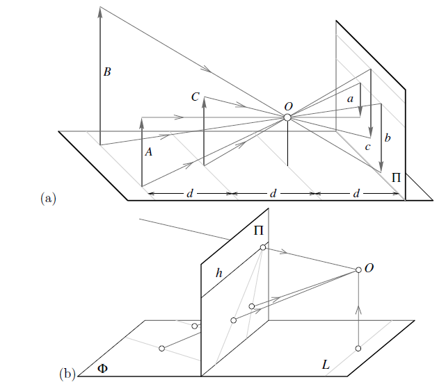
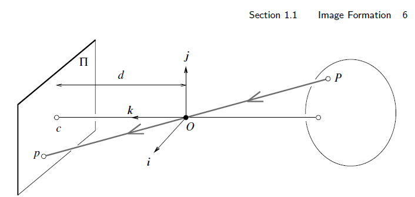
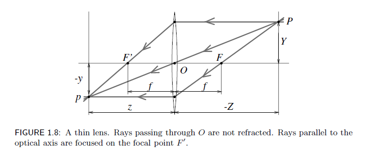
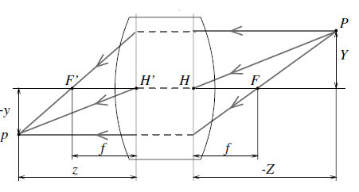
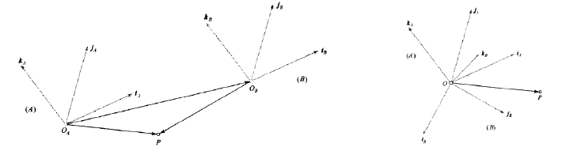
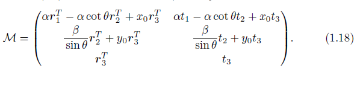
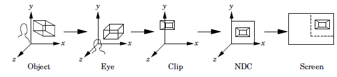

<script type="text/javascript" src="http://cdn.mathjax.org/mathjax/latest/MathJax.js?config=default"> </script>

# Notes for 3D Vision
+ this notes will cover some useful knowledge and techs for 3D vision(including multi-view geometry, linear algebra, camera models, etc.)
+ Structure
## 6D object pose estimation 
+ This part is currently based on my undergraduate thesis finished in early 2019, something might be out of date, but it will update to the state-of-the-art later.
+ Concepts
  + Camera Model[1]\
    To define object pose, we need to understand how camera transfer obj from real word to images.
    + Pinhole Perspective(cental perspective)\
      
      + inverted images
      + apparent size of objs depends on their distance
      + projections of two parallel lines lying in some plane appear to converge on a horizon line h
        + some have no images
      + Coordinates:\
        
        + origin $O$ pinhole, basis $i$,$j$ parallel image plane
        + $c$ image center $Oc$ optical axis
        + mapping $P(X,Y,Z)$ to $p(x,y,z)$
          + $P,O,p$ colinear leads to $Op= \lambda OP$ , so that
          $$ \lambda = \frac{x}{X} = \frac{y}{Y}=\frac{d}{Z}$$
          + therefore 
          $$x=d\frac{X}{Z},y=d\frac{Y}{Z}$$  
      + weak perspective(scaled orthography)
        + fronto-parallel palnes
          + vectors are parallel to their iamges
    + Camera with Lenses
      + ideal thin len\
        
        $$\frac{1}{z}-\frac{1}{Z} = \frac{1}{f}$$
        where $f=\frac{R}{2(n-1)}$, surface redius R$R$, index of refraction $n$
        + notice field of view of a camera also depends on effective area of the retina
      + simple thick lens\ 
        
        + aberrations
          + spherical aberration
            + longitudinal spherical aberrration
            + transverse shpereical aberration
          + coma
          + astigmatism
          + field curvature
          + distortion
            + different areas of a lens have sightly different focal length
    + Instrinsic and Extrinsic Parameters
      + Rigid Transformation and Homogeneous Coordinates\
         tranlation and rotation
        + transform in non-homogeneous coordinates
          $$^AP=R^BP+t$$
        + in homogeneous coordinates
          $$ ^A P =T^B P,where\ T^B=  \left \{\begin{array}{cc}
                                               	R	&t  \\
                                              	0	& 1
                                              \end{array} \right\}$$
        + Rotations
          + parameterized by three Euler angles
            + rotation matrix from B to A
              $$ R^A_B\stackrel{def}{=}(^Ai_B,^Aj_B,^Ak_B)=\left(\begin{array}{ccc}
                                      i_A\cdot i_B& j_A\cdot i_B& k_A\cdot i_B\\
                                      i_A\cdot j_B& j_A\cdot j_B& k_A\cdot j_B\\
                                      i_A\cdot k_B& j_A\cdot k_B& k_A\cdot k_B
                                       \end{array}\right)$$
          + Rodrigues's rotation formula
            + rotate $v$ around unit vector $k$ by an angle $\theta$ according to right hand rule
            $$ v_{rot} = v cos\theta+(k\times v) sin\theta + k(k\cdot v)(1-cos\theta)$$
            + Rotation matrix 
              $$Rot(k,\theta) = I + (sin\theta)K+(1-cos\theta)K^2$$
              where $K=\left[\begin{array}{ccc}0 &-k_z & k_y\\k_z&0&-k_x\\-k_y & k_x & 0\end{array}\right]$
        + perspective projection in homogeneous Coordinate 
          + 3x4 matrix $M$
            $$p=\frac{1}{Z}MP$$
      + Intrinsic Parameters
        + normalized coordinate system
          $$\hat{p} = \frac{1}{Z}(Id 0)P$$
          where $\hat{p} \stackrel{def}{=}(\hat{x},\hat{y},1)^T$
          + but retina not located at a distance $f\neq 1$ from the pinhole
            + we assume that camera is focused at infinit so distance between the pinhole and the image is equal to the focal length
          + and image point expressed in pixel units
          + pixel may be rectangualr
            + two additional scale paramters k and l\
              $\left\{ \begin{array}{c} 
                            x = kf\frac{X}{Z}\\
                            y = lf\frac{Y}{Z}
                        \end{array}\right. $
            + k,l adn f are not independt
              + $\alpha=kf$ and $\beta=lf$ to expressed pixel units
          + actual origin at a corner of the retina\
            $\left\{ \begin{array}{c} 
                            x = \alpha\hat{x}+x_0\\
                            y = \beta\hat{y}+y_0
                        \end{array}\right. $
          + skew
            + due to some manufacturing error
          $$ p = K\hat{p}, where p =  $\left( \begin{array}{c} x \\ y\\1        \end{array}\right), and K\stackrel{def}{=}$\left( \begin{array}{ccc} 
                            \alpha & -\alpha cot\theta & x_0\\
                            0 &  \frac{\beta}{sin\theta} & y_0\\ 0 & 0 &1
                        \end{array}\right) $$
      + Extrinsic Parameters
        + equation above is written in coordinate frame (C) attatched to the camera
        + we need to transfer it to world coordinate system
          + rigid transformation
            $$ ^C P=\left(\begin{array}{cc}R&t\\0^T 1\end{array}\right)^WP$$
      + $ p =\frac{1}{Z}MP, where M = K(R t)$
        + Z not indenpendt of M and P
        + perspective matrix M can be written into 5 intrinsic parameters three rows of R and three coordiantes of t
          
  + OpenGL
    + from model to screen\
      
    + MVP matrix
      + ProjectionMatrix
        + orthognal or perspective
      + ViewMatrix
        + lookAt(camera position,rotation,direction)
      + ModelMatrix
      + P*V*M*position
  + 6D Object pose
    + rigid transformation of target object to camera frame(C)
    + degree of free dom (3 for rotation 3 for translation) $P=[R|t] \in SE(3)$
    + object pose vs camera pose
      + object pose is object position relative to camera(Model matrix)
      + camera pose is vice versa (related to View matrix)
+ Challenges
  + occlusion
  + symmetric
  + data
+ Methods
  + RGB-D based
    + mostly using traditional feature
    + Template Matching
      + LineMod
    + point-pair feature
      + point-pari feature
      + drost-10
      + Vidal-18
    + Learning based
      + Brachmann-14
        + random forest
        + RANSAC
  + RGB based
    + mostly using deep learning
    + Directly predict Pose
      + PoseNet
        + sematic labeling
        + tranlation estimation
        + rotation estimation
      + Normalized Object Coordinate Space
        + category-level predict
    + predict keypoints
      + predict 3d bounding boxes 
        + based on detection frameworks
          + SSD-6D
          + YOLO
            + confidential score
              $$c(x)=\left\{\begin{array}{l}e^{\alpha(1-\frac{D_T(x)}{d_{th}})},D_T(x)<d_{th}\\ 0,otherwise\end{array}\right.$$
        + heatmap
      + searching keypoints
  + post-processing
    + ICP algorithm
      + iterative closest point
      + refine pose
      + Given: two corresponding point sets\
        $X={x_1,...,x_n},P={p_1,...,p_n}$
      + refined R and t that minimizes
        $$E(R,t) =\frac{1}{N_p}\sum^{N_p}_{i=1}||x_i-Rp_i-t||^2$$
      ```
         for pt in the src:
            match the closest point in the reference point cloud(or selected set) using current transformation
         estimate the R and t minimize loss function for all point pairs# might weighting or reject outliers
         if under threshold:
            stop
         else:
             update transformation and continue iterate
      ```
      + variants
    + PnP(perspective-n-Points)
      + DLT(Direct Linear Tranforamtion)
        + ignore limition on rotation matrix
        + least square
      + P3P
        + RANSAC
      + EPnP
+ Datasets
+ Evaluation
  + Accuracy based on reprojection error
    + true positive if mean error of reprojected error less than threshold()
  + 5cm 5 degree accuracy
    + tranlation error less than 5cm
    + rotation error less than 5 degree
  + ADD
    + $ m =avg_{x\in M}||R_{gt}x+T_{gt}-(R_{pd}x+T_{pd})||$
    + true positive when $K_m d\geq m$ $k_m$ is a chosen coefficient and d is the model diamter
    + for symetric, ADI
      + $m = avg_{x_1\in M}min_{x_2\inM}||R_{gt}x_1+T_{gt}-(R_{pd}x_2+T_{pd})||$
## References
[1] Computer Vision A Mordern Approach(second edition); David A. Forsyth,  Jean Ponce
