# Notes for GPU Accelerating Computing

+ Ref:
+ Heterogeneous Computing
  + CPU: Latency Oriented Cores\
    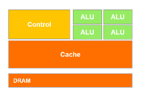
    + Powerful ALU
    + Large caches
    + sophisticated control
      + branch prediction for reduced branch latency
      + Data forwarding for reduce data latency
    + for sequential parts
  + GPU: Throughput Oriented Cores\
  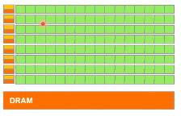
    + Small cahces
    + Simple control
    + Energy efficient ALUs
    + Massive numer of threads to tolerate latencies
    + For parallel parts
  + Key of Software cost
    + Scalability
    + Portability
+ Data Parallelism
  + CUDA Memories
  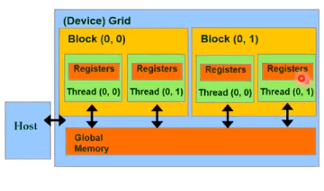
    + Device code
      + R/W per-thread registers
      + R/W all-shared global mem
    + Host code
      + Transfer data to/from grid global memory
    + CUDA mem Management API
      + ```cudaMalloc()```
        + allocates an object in the device global memory
        + two params
          + Address of pointer to the allocated object
          + size of allocated object in terms of bytes
        ```
        cudaError_t err = cudaMalloc((void **)&d_A,size);
        if (err !=cuaSuccess){
            printf("%s in %s at line %d \n", cudaGetErrorString(err,__FILE__,__LINE__);
            exit(EXIT_FAILURE);
        }
        ```
      + ```cudaFree()```
        + Free object from device global mem
        + param - POinter to the freed obj
      + ```cudaMemcpy()```
        + memory data transfer
        + 4 params
          + ptr to dest
          + ptr to src
          + number of bytes copied
          + Type/Direction of transfer
        + Transfer to device is synchronous with respect to the host
      + ``` cudaMallocManaged(void** ptr, size_t size)```
        + unified memory\
          
        single mem space for all CPUs/GPUs
        + CUDA-managed dta
        + compatible wit hcudaMalloc(),cudaFree()
        + can be optimized
    + e.g. Vector addition
      ```
      Allocate h_A,h_B,h_C
      
      void vecAdd(float *h_A,float *h_B,float *h_C, int n){
        int size = n * sizeof(float);float *d_A, *d_B,*d_C;
        cudaMalloc((void **)&d_A,size);
        cudaMalloc((void **)&d_B,size);
        cudaMalloc((void **)&d_C,size);
        cudaMemcpy(d_A,h_A,size,cudaMemcpyHostToDevice);
        cudaMemcpy(d_B,h_B,size,cudaMemcpyHostToDevice);
        //Kernel invocation code, shown later
        cudaMemcpy(d_A,h_A,size,cudaMemcpyHostToDevice);
        cudaFree(d_A);cudaFree(d_B);cudaFree(d_C);
      }

      Free h_A,h_B,h_C
      ```
  + CUDA Execution Model
    + serial parts in host C cod
    + parallel parts in devide SPMD kernel code
    + Von-Neumann Processor\
      
  + Arrays of Parallel Threads
    + CUDA kernel is executed by a grid(array) of threads
      + all threads in a grid run the same kernel program
      + each thread has indexes that it uses to cumpute mem addr and make control decisions
      + ``` i = blockIdx.x*blockDim.x + threadIdx.x```
    + Thread Blocks
      + scalable cooperation
      + divede thread array into multiple blocks
         + within a block cooperate via shared mem, atomic operations ,barrier synchronization
         + Diff blocks do not interact.
      + kernel vs block
        + kernel is more like a function 
        + block is division of threads
      + blockIdx and thread Idx\
      
        + each thread uses indices to decide what data to work on
        + simplifie mem addressing when processing multidimensional data
      + Exmaple: Vec Addition Kernel
        ```
        //Device Code
        __global__
        void vecAddKernel(float* A, float* B, float* C,int n){
            //each thread performs one pair-wise addition
            int i = threadIdx.x + blockDim.x*blockIdx.x;
            if (i<n) c[i] = A[i] + B[i];
        }
        ```

        host allocate mem on the dev
        ```
        //Host Code
        __host__
        void vecAdd(float* H_A,float* h_B, float* h_C, int n){
            // d_A,d_B,d_C allocations and initialize

            //run ceil(n/256.0) blocks of 256 threads each
            dim3 DimGrid((n-1)/256+1,1,1);//y-dim,z-dim=1
            dim3 DimBlock(256,1,1);
            vecAddKernel<<<DimGrid,DimBLock>>>(d_A,d_B,d_C,n);
            //code copy results to h_c
        }
        ```
        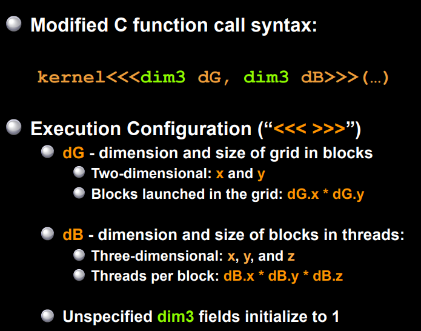
        

        + __global__ defines a kernle function
          + a kernel func must return void
        + __device__ and __host__ can be used together
        + __host__ is optional if used alone
    + Compiling A CUDA Program
      
    + Multi-dim grid
      + 
+ Performance on a GPU
  + Mem access is slow
  + More calculation for each Mem access
  + e.g. Matrix Multiplication
+ Declaring CUDA Variables
  
  + __device__ is optional when used with __shared or __constant__
  + Automatic variables reside in a register
    + per-thread arras reside in global mem
  + Where to access
    + can host access
      + yes: ouside of any func(global constant)
      + no in the kernel(register shared)
  + Tiling/BLocking
    + divide the global memory content to on-chip mem
    + Barrier Synchronization
      + require and wait all thread reach the point
      + make sure all data
    + Basic concept
      + e.g. carpool, need synchronization
      + Tiled Matrix Multiplication
        + break up the execution of each thread inot phases
        + so foucs on one tile of Mat M and one tile Mat N
        + the tile is of BLOCK_SIZE in each dim
        + for pahse p,ehach tile loads
          ``` 
          M[Row][p*TILE_WIDTH+tx]
          N[(p*TILE_WIDTH+ty)*WIDTH+Col]
          ```
      + Strip-mining
    + Tile(thread block) Siz 
      + TILE_WIDTH 2*4B shared mem
        + 16, 16*16,256*4B=2KB,16-bit float up to thread block executing 8*512=4096 pending loads
        + 32 1024*2*4B=8KB shared mem,32-bit float
      + For SM with 16KB shared Mem
        + TILE_WIDTH = 16 8 thread blocks executing,4096=2loads/thread *256threads/block * 8 blocks pending loads
        + TILE_WIDTH = 32, up to 2 thread blocks executing according to shared mem usage
      + ```__syncthreads()```
    + Inner Product
      ``` 
          if (Row<Width && Col< Width){
            for (int i=0;i<TILE_WIDTH;++i){
              Pvalue += ds_M[ty][i]* ds_N[i][tx];
            }
            __syncthreads();
      }/*end of outer for loop*/
      if (Row<Width && Col< Width){
        P[Row*Width+Col] = Pvalue;
      }
      }/*end of kernel
      ```
    + Handling General Rectangular Mat
      + jxk M mattrix with a kxi N matrix in a jxi P marix
      + width argument replaced by j,k,i
+ Thread Execution Efficiency
  + CUDA thread execution
    + Warp partitioning
        + Warp as scheduling Units
        + Each block divided into 32-thread warps
          + implementation ech
          + in SM
          + warp ececute SIMD manner
          + number of threads in a warp may vary in future gens
        + warps in multi-dim
          + first linearized into 1D in row major order (x first, y next, z last)
        + same instruction at any point in time
        + efficiently all threads follow the same control flow path
          + all if same decision 
          + loops iterate the same umber of times
      + SIMD Hardware
      + Control Divergence
        + occurs when threads in a warp take diff control flow path by making diff control decisions
        + serilized in the same GPU
        + Performance impact of control divergence
          + Doundary condition check
          + data dependent
        + Analysis
          + 16x16 tiles and thread blocks
          + 8 warps 256/32
          + square matrices of 100x100
+ Memory Access
  + Memory bandwidth matters
      + first-order performance factor in a massively parallel processor
        + DRAM bursts,bancks and channels
        + also applicable to modern multicore processors
      + Global Memory(DRAM) Bandwidth
    + Memory coalescing
      + important for effectively utilizing mem bandwidth in CUDA
      + multiple threads get data in one read operatio
      + DRAM burst
      + how to judge
        + acccesses in a warp are to consectutive lcoation
        + fully coalesced if independent part of exp is multile of burst size
      + uncoalescete make some of the bytes accested transferred but not used
    + Corner Turning
+ Parallel Histogram Computational pattern
  + data races
    + occur when performing read-modify-write operation in parallel programs
    + cause errors that are hard to reporduce
    + atomic operations
  + atomic arithmetic ops
    + calling funcs tranlated ito single instrucs
      + ``` atomicAdd```
  ```
  __global__ void histo_kkernel(unsigned char *buffer, long size, unsigned int * histo){
    int i = threadIdx.x + blockIdx.x * blockDim.x;
    int stride= blockDim.x +
  }
  ```
  + atomic op on
  + Privatization
+ Stencils/Convolution
  + ```
      __global__ void convolution_1D_basic_kernel(float*N, float*M, float*P, int Mask_Width,int Width){
        int i= blockIdx.x*blockDim.x + threadIdx.x;
        float Pv = 0;
        int N_start_point = i -( Mask_width/2);
        for (int j=0;j<Mask_width;j++){
          if (N_start_point+j>=0 && N_start_point+j<Width>){
            Pv += N[N_start_point+j]*M[j];
          }
        }
        P[i] = Pv;
      }
      ```
  + 1d conv tiled kernel
  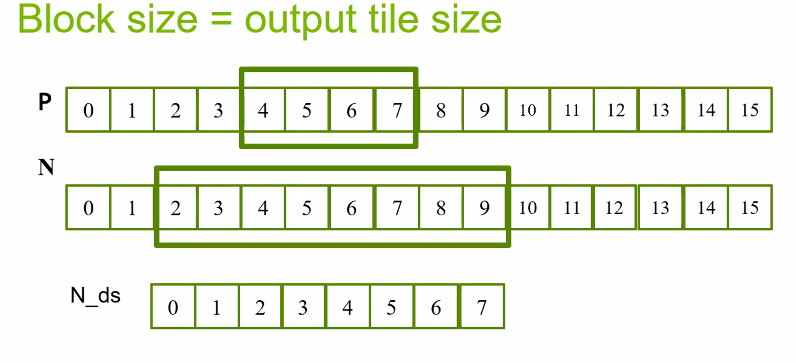
  ```
      __global__ void convolution_1D_basic_kernel(float*N, float*M, float*P, int Mask_Width,int Width){
        int i= blockIdx.x*blockDim.x + threadIdx.x;
        int n = MASK_WIDTH/2;
        int halo_index_left = (blockIdx-1)*blockDim.x + ThreadIdx.x;
        if (threadIdx.x>=blockDim.x-n){
          N_ds[threadIdx.x-(blockDim.x-n)]=(halo_index_left<0>)?0:N[halo_index_left];;
          N_ds[n+threadIdx.x] = N[block*blockDim.x+threadIdx.x];
        }
        int halo_index_right = (blockIdx+1)*blockDim.x + ThreadIdx.x;
        if (threadIdx.x<n){
          N_ds[n+threadIdx.x+blockDim.x]=(halo_index_right>n)?0:N[halo_index_right];
          N_ds[n+threadIdx.x] = N[block*blockDim.x+threadIdx.x];    
        }
        float Pv = 0;
        for (int j=0;j<Mask_width;j++){
          if (N_start_point+j>=0 && N_start_point+j<Width>){
            Pv += N[N_start_point+j]*M[j];
          }
        }
        P[i] = Pv;
      }
  ```
    + need sync thread to make sure all mem load have done
    + ```__syncthreads();``` before for loop
  + Constant memory
    + ```__constant__``` as global
    + visible to all thread blocks
    + initialized by host -- cannot be chaged by thread during kernel execution
    + small
    
  + Cost-benefit analysis
    +
+ Reduction
  + Efficent Sequential Reduction O(N)
    + initialize the result as an identity value for the reduction operation
      + max : smallest possible val
      + min : largest .. ..
      + sum: 0
      + product : 1
    + Quick Analysis
      + (1/2)N + (1/4)N + (1/8)N + ... +1 = (1-1/N)N =  N-1 ops
      +
    + Reduction Tree in CUDA
      + Basic kernel
      + parallel implementation
      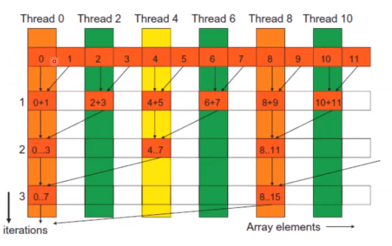
      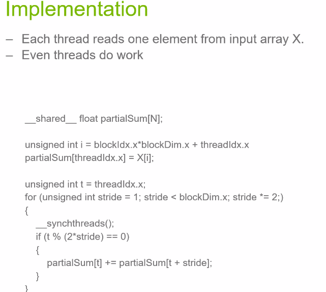
+ Parallel Scan(prefix sum)
  + Definition
    + takes a binary associative operate $\oplus$, and an array of n elements $[x_0,x_1,...,x_{n-1}]$
    and returns the array
  + Application
    + building block
    + for may parallel programs
+ Efficien Data Transfer
  + PCI as Meme Mapped I/O\
  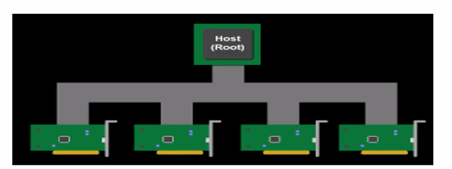
    + PCI dev registers are mapped into the CPU's physical addr space
      + through loads/stored(kernel mode)
    + addr are assigned to the PCI at boot time
  + Express(PCIe)
    + switched,p2p connection
      + no bus arbitration
      + packet swtiches message form virtual chanlle
      + Prioritized packets for QoS
        + e.g. real-time video streaming
  + Data Transfer using DMA
    + DMA(Directed Mem Acc) 
      + fully utilize the bandwidth of an I/Obus
      + physical ddr for src and dest
      + anumber of bytes requested by OS
      + needs pinned mem
      + DMA harware much faster than CPU software and frees the CPU for other tasks during the data transfer
    + used for CudaMemcpy()\
      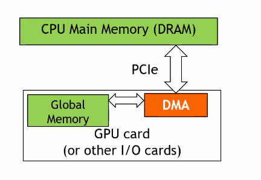
    + Pinned Mem
      + virtual memory pages marked so that they cannnot be paged out
      + allocated with a special sys API func
    + CUDA Sreams
      + efficiently transfer data
      + task parallelism
      + Serialized Data Transfer and Computation
      + some CUA devices suppport device overalap
        + simultaneously execute a kernel while copying data between device and host mem
      + Ideal,Peiplined Timing\
        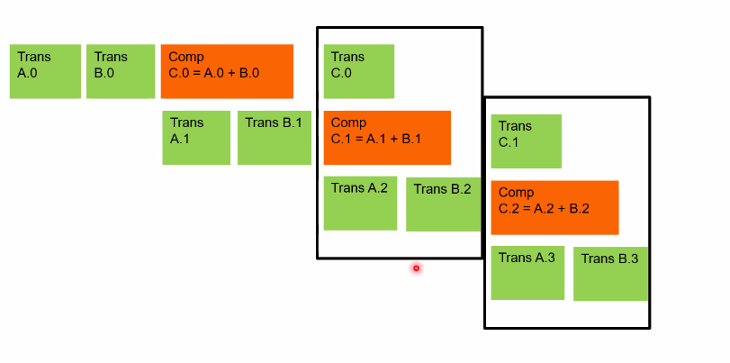
        + Divide large vects inot segs
        + Overlap transfer and copute of adjacent segs
      + each stream is a queue of ps(kernel lauches and cudaMemcpy() calls)
        + FIFO que
        + readn and processed async 
      + to allow concurrent copying and kernel, use multiple queues\
      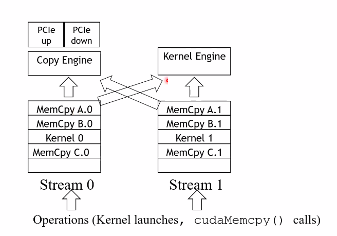d
      ```
      cudaStream_t stream0,stream1;
      cudaStreamCreate(&stream0);
      cudaStreamCreate(&stream1);
      ```
      Host Code
      ```
      for (int i=0;i<n;i+=segSize*2>){
        cudaMemcpyAsync(d_A0,h_A+i,segSize*sizeof(float,...,stream0));
      }
      ```
    + Data Prefetching CUDA API
      + cudaMemPrefetchAsync()
        + univied mem addr of
    ```
    void function(int * data cudaStream_t stream){
      //data must've been allocated with cuda MallocManaged((void**)&data,N);
      init(data,N);
      cudaMemPrefetechAsync(data,N*sizeof(int),myGpuId,stream);
      kernel<<<...>>>
    }
    ```
    + CUDA unified mem - mem advisor
      + hints can be provided to the driver on how data will be used during runtime
      + one example of when we 
+ Floating point considerations
  + 
+ CUDA Event API
  + ```
    cudaEvent_t start, stop;
    cudaEventCreate(&start);
    cudaEventCreate(&stop);
    //initialize mem on dev
    cudaEventRecord(start);
    cudaEventRecord(stop);
    cudaEventSynchronize(stop);
    
    float milliseconds =0;
    cudaEventElapsedTime(&milliseconds,start,stop);
    cudaEventDestrop(start);
    cudaEventDestroy(stop);
    ```
+ Project
       
  