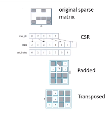

# Notes for GPU Accelerating Computing

+ Ref:
+ Coding
  + Terminology 
    + Host:CPU and its mem
    + Device: GPU and its mem
  + Simple Processing Flow
    + copy input data from CPU mem to GPU mem
    + loade  GPUcoe and execute it, caching data on chip for performance
    + copy results from GPU mem to CPU mem
  + compile and run
    + ```nvcc -o single-thread-vector-add 01-vector-add/01-vector-add.cu -run```
    + ```nsys profile --stats=true ./single-thread-vector-add```
    + ```nsys profile --stats=true ./page-faults```
    + ```nvprof ./page-faults```
    + ```nsight-sys``` system view
    + ```nsight-compute``` kernel view
  + keywords and APIs
    + ```__global__``` func runs on the dev called by host
    + ```<<<>>>```call from host code to device code
    + ```cudaMalloc(),cudaFree(),cudaMemcpy()```
    + ```cudaDeviceSynchronize()```
    + mem prefetch
      ```
      int deviceId;
      cudaGetDevice(&deviceId); 
      cudaMemPrefetchAsync(pointerToSomeUMData, size, deviceId);        // Prefetch to GPU device.
      cudaMemPrefetchAsync(pointerToSomeUMData, size, cudaCpuDeviceId); // Prefetch to host. `cudaCpuDeviceId` is a
                                                                  // built-in CUDA variable.
      ```
    + best num of blocks
      ```
      int numberOfSMs;
      cudaDeviceGetAttribute(&numberOfSMs, cudaDevAttrMultiProcessorCount, deviceId);
      int number_of_blocks = numberofSMs * 32;
      ```
    + cuda stream
      ```
      cudaStream_t stream;       // CUDA streams are of type `cudaStream_t`.
      cudaStreamCreate(&stream); // Note that a pointer must be passed to `cudaCreateStream`.

      someKernel<<<number_of_blocks, threads_per_block, 0, stream>>>(); // `stream` is passed as 4th EC argument.

      cudaStreamDestroy(stream); // Note that a value, not a pointer, is passed to `cudaDestroyStream`
      ```
+ Heterogeneous Computing
  + CPU: Latency Oriented Cores\
    
    + Powerful ALU
    + Large caches
    + sophisticated control
      + branch prediction for reduced branch latency
      + Data forwarding for reduce data latency
    + for sequential parts
  + GPU: Throughput Oriented Cores\
  
    + Small cahces
    + Simple control
    + Energy efficient ALUs
    + Massive numer of threads to tolerate latencies
    + For parallel parts
  + Key of Software cost
    + Scalability
    + Portability
+ Data Parallelism
  + CUDA Memories
  
    + Device code
      + R/W per-thread registers
      + R/W all-shared global mem
    + Host code
      + Transfer data to/from grid global memory
    + CUDA mem Management API
      + ```cudaMalloc()```
        + allocates an object in the device global memory
        + two params
          + Address of pointer to the allocated object
          + size of allocated object in terms of bytes
        ```
        cudaError_t err = cudaMalloc((void **)&d_A,size);
        if (err !=cuaSuccess){
            printf("%s in %s at line %d \n", cudaGetErrorString(err,__FILE__,__LINE__);
            exit(EXIT_FAILURE);
        }
        ```
      + ```cudaFree()```
        + Free object from device global mem
        + param - POinter to the freed obj
      + ```cudaMemcpy()```
        + memory data transfer
        + 4 params
          + ptr to dest
          + ptr to src
          + number of bytes copied
          + Type/Direction of transfer
        + Transfer to device is synchronous with respect to the host
      + ``` cudaMallocManaged(void** ptr, size_t size)```
        + unified memory\
          
        single mem space for all CPUs/GPUs
        + CUDA-managed dta
        + compatible wit hcudaMalloc(),cudaFree()
        + can be optimized
    + e.g. Vector addition
      ```
      Allocate h_A,h_B,h_C
      
      void vecAdd(float *h_A,float *h_B,float *h_C, int n){
        int size = n * sizeof(float);float *d_A, *d_B,*d_C;
        cudaMalloc((void **)&d_A,size);
        cudaMalloc((void **)&d_B,size);
        cudaMalloc((void **)&d_C,size);
        cudaMemcpy(d_A,h_A,size,cudaMemcpyHostToDevice);
        cudaMemcpy(d_B,h_B,size,cudaMemcpyHostToDevice);
        //Kernel invocation code, shown later
        cudaMemcpy(d_A,h_A,size,cudaMemcpyHostToDevice);
        cudaFree(d_A);cudaFree(d_B);cudaFree(d_C);
      }

      Free h_A,h_B,h_C
      ```
  + CUDA Execution Model
    + serial parts in host C cod
    + parallel parts in devide SPMD kernel code
    + Von-Neumann Processor\
      
    + Executing THread Blocks
      + Threads are assigned to Streaming Multiprocessors(SM) in block granularity
      + up to 32 blocks to each SM as resource allows
      + vlota SM can tak up to 2048 threads
        + 256 * 8 blocks
        + or 512 *4
      + SM maintains thread/block idx #s
      + SM manages/schedules thread execution\
      \
            
      + Warps as Scheduling Units
        + Each block 32-thread Warps
        + implemeantaion decision not part of CUDA
        + scheudling units in SM
        + execute in SIMD
        + Future GPU may have different # of warps
        + Warp Example\
          
          + 3 blocks 256 threads
          + 256/32 8 Warps
          + 8*3 = 24 warps
      + Thread Scheduling
        + zero-overhead warp scheduling
          + warps whose next insturction has its operands read for consuption are eligible for execution
          + eligible warps are selected for based on a prioritized scheduling policy
          + all threads in a warp execute the same instuction when selected
          + keep track of each instruction - latency hiding  
  + Arrays of Parallel Threads
    + CUDA kernel is executed by a grid(array) of threads
      + all threads in a grid run the same kernel program
      + each thread has indexes that it uses to cumpute mem addr and make control decisions
      + ``` i = blockIdx.x*blockDim.x + threadIdx.x```
    + Thread Blocks
      + scalable cooperation
      + divede thread array into multiple blocks
         + within a block cooperate via shared mem, atomic operations ,barrier synchronization
         + Diff blocks do not interact.
      + kernel vs block
        + kernel is more like a function 
        + block is division of threads
      + blockIdx and thread Idx\
      
        + each thread uses indices to decide what data to work on
        + simplifie mem addressing when processing multidimensional data
      + Exmaple: Vec Addition Kernel
        ```
        //Device Code
        __global__
        void vecAddKernel(float* A, float* B, float* C,int n){
            //each thread performs one pair-wise addition
            int i = threadIdx.x + blockDim.x*blockIdx.x;
            if (i<n) c[i] = A[i] + B[i];
        }
        ```
        host allocate mem on the dev
        ```
        //Host Code
        __host__
        void vecAdd(float* H_A,float* h_B, float* h_C, int n){
            // d_A,d_B,d_C allocations and initialize

            //run ceil(n/256.0) blocks of 256 threads each
            dim3 DimGrid((n-1)/256+1,1,1);//y-dim,z-dim=1
            dim3 DimBlock(256,1,1);
            vecAddKernel<<<DimGrid,DimBLock>>>(d_A,d_B,d_C,n);
            //code copy results to h_c
        }
        ```
        
        

        + __global__ defines a kernle function
          + a kernel func must return void
        + __device__ and __host__ can be used together
        + __host__ is optional if used alone
        + calculate two adajacent elements 
          + i = 2*(threadIdx.x + blockDim.x*blockIdx.x)
          + i,i+1
    + Multi-dim grid
      + example
        ```
        dim3 dimGrid(2,2,1)
        dim3 dimBlock(4,2,2)
        Kernel1<<dimGrid,dimBlock>>>(...);
        ```  
        
        labels given in order (z,y,x)
      + 2d picture
        + row-major layout (row first)
          
          ```
          __global__ void PictureKernel(float* d_Pin,float* d_Pout, int height, int width){
            int Row = blockIdx.y*blockDim.y + threadIdx.y;
            int Col = blockIdx.x*blockDim.x+threadIdx.x;
            if ((d_Pout[Row*width+Col])=2.0*d_Pin[Row*width+Col])
          }
          ```
          Host code
          ```
          dim3 DimGrid((n-1)/16+1,(m-1)/16+1);
          dim3 DimBlock(16,16,1);
          PictureKernel<<<DimGrid,DimBlock>>>(d_Pin,d_Pout,m,n);
          ```
        + RGB to Grayscale Conversion
          + gray = 0.21*r+0.71*g+0.07*b
          ```
          #define ChNNELS 3
          __global__ void colorCOnvert(unsigned char *grayImage unsigned char * rgbImage, int w, int h){
              int x = theradIdx.x + blockIdx.x*blockDim.x;
              int y = theradIdx.y + blockIdx.y*blockDim.y;
              if (x<w && y<h){
                int grayOffset = y*w + x;
                int rgbOffset = graOffset*CHANNELS;
                usgined char r = rgbImage[rgbOffset];
                usgined char g = rgbImage[rgbOffset+1];
                usgined char b = rgbImage[rgbOffset+2];
                grayImage[grayOffset] = 0.21*r+0.71*g+0.07*b;
              }
          }
          ```
        + Image Blur
          ```
          __global__
          void blurKernel(unsigned char *in, unsigned char * out, int w, int h){
              int Col = theradIdx.x + blockIdx.x*blockDim.x;
              int Row = theradIdx.y + blockIdx.y*blockDim.y;
              if (Col<w && Row <h){
                int pixVal = 0;
                int pixels = 0;
              }
              for (int blurRow=-BLUR_SIZE;blurRow<BLUR_SIZE+1;++blurRow){
                  for (int blurCol=-BLUR_SIZE;blurCol<BLUR_SIZE+1;++blurCol){
                      int curRow = Row+blurRow;
                      int curCol = Col+blurCol;
                      if (curRow>-1 && curRow<h && curCol > -1 && curCol<w){
                          pixVal += in[curRow*w + curCol];
                          pixels++;
                      }
                  }
              }
              out[Row*w+Col] = (unsigned char)(pixVla/pixels);
          }
          ```
        + Transparent Scalability\
        
        

    + Compiling A CUDA Program
      
+ GPU Memory Efficency    
  + Performance on a GPU
    + all theads access global mem for input
      + one mem acc per float
      + to achieve peak badwidth need 4B/s for each FLOP/s
    + Assume a GPU with 
      + peak floating-point rate 1600 GFLOPS with 600GB/s DRAM bandwidth
      + 4(GB/GF)*1,600(GF/s) = 6400GB/s to achieve peak FLOPS rating
      + 600GB/s mem bandwidth lim the execution at (600GB/sec/4GB/GF) =150 GFLOPS
      + 9.3%
    + Mem access is slow
    + More calculation for each Mem access
    + e.g. Matrix Multiplication
      + 
        
      + Basic
        ```
        __global__ void MatrixMulKernel(flaot* M,float* N,float * P, int w){
          int Row =...;
          int Col = ...;
          if ((Row<w)and(Col<w){

          }
        }
        ```
      + CUDA Memeories\
        
        programmer view
        
        + Shared Memeory
          + special type of mem explicityl def adn used in kerne src code
            + one in each SM
            + acce at higher speed tha nglobal mem
            + ```__shared__``` 
        + Declaring CUDA Variables\
          
          + __device__ is optional when used with __shared or __constant__
          + Automatic variables reside in a register
            + per-thread arras reside in global mem
        + Where to declare
          + can host access
            + yes: ouside of any func(global constant)
            + no in the kernel(register shared)
        + Tiling/BLocking
          + reduce the limit effe of mem badwidth on parallel kernel performance
          + tiled algorithms and barrier synchronization
          + divide the global memory content to on-chip mem
          + Barrier Synchronization\
            
            + require and wait all thread reach the point
            + make sure all data
            + ``` __syncthreads()```
          + Basic concept
            + e.g. carpool, need synchronization, good when similar timming            
            + Techinique
              + indeintify a tile of glboal mem accessed by multi threads
              + Loda the tile from global
              + barrier sync to make sure all threadsa ar rdy to start
              + threads acces from the shared mem
              + use barrier sync to make sure all threads completed
              + to next tile
            + Tiled Matrix Multiplication
              + break up the execution of each thread inot phases
              + so foucs on one tile of Mat M and one tile Mat N
              + the tile is of BLOCK_SIZE in each dim
              + for pahse p,
                ```
                M[Row][p*TILE_WIDTH+threadIdx.x]=> M[Row*Width +p*TILE_WIDTH+threadIdx.x ]
                N[p*TILE_WIDTH+threadIdx.y][Col]=>N[(p*TILE_WIDTH+threadIdx.y)*WIDTH+Col]
                ```
                ```
                __shared__ float ds_M[TILE_WIDTH][TILE_WIDTH];
                __shared__ float ds_N[TILE_WIDTH][TILE_WIDTH];
                int Row = blockIdx.y*blockDim.y+threadIdx.y;
                int Col = blockIdx.x*blockDim.x+threadIdx.x;
                flaot Pv = 0;
                for (int p=0;p<n/TILE_WIDTH;p++){
                  ds_M[threadIdx.y][ThreadIdx.x] = M[Row*Width +p*TILE_WIDTH+threadIdx.x ];
                  ds_N[threadIdx.y][ThreadIdx.x] = N[(p*TILE_WIDTH+threadIdx.y)*WIDTH+Col];
                  __syncthread();
                  for (in i=0; i<TILE_WIDTH;i++) Pv += ds_M[threadIdx.y][i]*ds_N[i][threadIdx.x];
                  __syncthreads()
                  P[Row*Width+Col] = Pv;
                }             
                ```
            + Strip-mining
              + break up long loop into phases
                + each pahse consist of a sammler llop that exec consective iters of the orig looop
                + original becom outer interatively invoke inner loop
              + create phases need by tiling in data parallel programs
              + long been used for CPUs
          + Tile(thread block) Size 
            + TILE_WIDTH 2*4B shared mem/thread
              + 16, 16x16 threads,256x2x4B=2KB
              + 32 1024x2x4B=8KB shared mem,32-bit float
            + For SM with 16KB shared Mem
              + TILE_WIDTH = 16,up to 8 thread blocks executing,4096=2loads/thread x 256threads/block x 8 blocks pending loads
              + TILE_WIDTH = 32, up to 2 thread blocks executing according to shared mem usage
          + Arbitary Size(still square)
            + Boundary COndition for Input M Tile
              + Row < Width load otherwise load 0
            + Inner Product
              ``` 
                  if (Row<Width && Col< Width){
                    for (int i=0;i<TILE_WIDTH;++i){
                      Pvalue += ds_M[ty][i]* ds_N[i][tx];
                    }
                    __syncthreads();
              }/*end of outer for loop*/
              if (Row<Width && Col< Width){
                P[Row*Width+Col] = Pvalue;
              }
              }/*end of kernel
              ```
              + Control divergence
                + all follow same path as possible
                + 
          + Handling General Rectangular Mat
            + jxk M mattrix with a kxi N matrix in a jxi P marix
            + width argument replaced by j,k,i
+ Thread Execution Efficiency
  + CUDA thread execution
    + Warp partitioning
      + Warp as scheduling Units
      + Each block divided into 32-thread warps
        + implementation ech
        + in SM
        + warp ececute SIMD manner
        + number of threads in a warp may vary in future gens
      + warps in multi-dim
        + first linearized into 1D in row major order (x first, y next, z last)
      + same instruction at any point in time
      + efficiently all threads follow the same control flow path
        + all if same decision 
        + loops iterate the same umber of times
    + SIMD Hardware
      + SM are SIMD processors\
        
    + Control Divergence
        + occurs when threads in a warp take diff control flow path by making diff control decisions
          + same path can parallel
        + serilized in the same GPU
        + thread in the same warp might make control divergence
        + threads in diff warp will not
        + Performance impact of control divergence
          + Doundary condition check
          + data dependent
        + Analysis\
          
          + 16x16 tiles and thread blocks
          + 8 warps 256/32
          + square matrices of 100x100
          + 7 phases (100/16),49 thread blocks
            + Type 1:
              + 336(8*7*6) warps
              + 7 phases ,2352 warp-pahses
              + only last phase
              + 336 warp-phases have cd
            + Type 2:
              + 7 blocks for bottom tiles ,56 warps
              + 392 warp-pahses
              + first 2 valid and 6 reamining outside
              + 14 warp-pahses have control divergence
            + 336/2352 for Type 1 14/392 for Type 2
          + ? will padding help solve control divergence
      + 
+ Memory Access Performance
  + Memory bandwidth matters
      + first-order performance factor in a massively parallel processor
        + DRAM bursts,bancks and channels
        + also applicable to modern multicore processors
      + Global Memory(DRAM) Bandwidth
  + DRAM Core ARRay Orgnazation\
    
    + each core 16M bits
    + each bit stored in timy cpa made of one transistor
    
    + slow
      + DDR:core speed = 1/2 interface speed
      + DDR2/GDDR3 core speed = 1/4 interface speed
    + DRAM bursting
      + cores clocked at 1/N speed of the interface
        + load Nx inteface width of DRAM bits from the same row at once to buffer
    + 4B/transfer x 7 x2^30 cycles/s x 2 transfers/cycle = 56GB/s
  + Memory coalescing
    + important for effectively utilizing mem bandwidth in CUDA
    + multiple threads get data in one read operation
    + origin in DRAM burst
    + when all threads of a warp execute a load instru if all accessed fall into the same burst sec, only one DRAM req will be made adn the access is fully coalesced
    + how to judge
      + acccesses in a warp are to consectutive lcoation
      + fully coalesced if independent part of exp is multile of burst size
    + uncoalescete make some of the bytes accested transferred but not used
    + loading a ninput tile
      + we can load however we like to coalepse
      + Corner Turning\
        
+ Parallel Histogram Computational pattern
  + define bins and count for each bins
  + simple paralel algorithm\
    
    + partition input inot sections
    + have each thread tak a sec of the input
    + each thread iterates through its sec
    + for eac hletter increment the apporapriate bin counter
    + but data uncoalescing
    + improve: interleaved partition
    + cpu work better on simple since cache
  + data races
    + occur when performing read-modify-write operation in parallel programs
    + cause errors that are hard to reporduce
    + use atomic operations
  + atomic operations
    + only one r-m-w op on the same location can be performing
    + others will be held in a queue
    + all threads serially on the same loc
    + in CUDA:
      + calling funcs tranlated ito single instrucs
        + ``` atomicAdd(int * addr, int val);```
        + read 32-bit word old from the loc by addr in global or shared mem
        + cal (old+val)
        + store result back to mem at the same and ret old
        + in one atomic transaction
        ```
        __global__ void histo_kkernel(unsigned char *buffer, long size, unsigned int * histo){
          int i = threadIdx.x + blockIdx.x * blockDim.x;
          int stride = blockDim.x *gridDim.x;
          while (i<size){
            int alphabet_pos = buffer[i]-"a";
            if (alphabet_pos >= 0 && alpha_pos<26)
                atomicAdd(&(histo[alphabet_pos/4]),1);
            i += stride;
          }
        }
        ```
    + performance consideration
      + on global mem(DRAM)
        
        + two delays:read and write
      + shared mem
        + short latency
        + private to each thread block
        + need algorihtm work by programmers
    + Priviatization 
      + reduce latency, increase throughput and reduce serailization
      + using mem and L2 cache atommic ops
      + cost
        + overahead for cartea and ini priv copies
        + overhead for acc the contesnts of private and final
      + Benefit
        + less contention and serialization in acc both the private copies and the final 
        + overall performance can often be improved more than 10x
      + create private copies of histo[ for each thread block
        ``` __global__ void histo_kernel(unsigned char * buffer, long size,unsigned int * histo){
          __shared__ unsigned int histo_private[7];
          if (threadIdx.x<7) histo_private[threadid.x] = 0;
          __syncthreads();
          ...
          __syncthreads();
          if (threadIdx.x <7){
            atomicAdd(&hist[threadIdx.x],private_histo[threadIdx.x]);
          }
         }
        ```
      + ops needs to be associative and commutative
      + private histo size needs to be small fit into shared mem
+ Stencils/Convolution\
  + naive 1d conv\
    
    
    ```
      __global__ void convolution_1D_basic_kernel(float*N, float*M, float*P, int Mask_Width,int Width){
        int i= blockIdx.x*blockDim.x + threadIdx.x;
        float Pv = 0;
        int N_start_point = i -( Mask_width/2);
        for (int j=0;j<Mask_width;j++){
          if (N_start_point+j>=0 && N_start_point+j<Width){
            Pv += N[N_start_point+j]*M[j];//coalesced
          }
        }
        P[i] = Pv;
      }
      ```
  + naive 2d Conv\
  
    + have ghost cells too
      ```
        __global__ void convolution_2D_basic_kernel(float* in, float* mask, float* out, int mask_width,int w,int h){
          int Col = blockIdx.x*blockDim.x + threadIdx.x;
          int Row = blockIdx.y*blockDim.y + threadIdx.y;
          if (Col < w && Row<h){
            float Pv = 0;
            int N_start_col = Col -( mask_width/2);
            int N_start_row = Row -( mask_width/2);
            for (int j=0;j<Mask_width;j++){
              for (int k=0;k<Mask_width;k++){
                int curRow = N_start_row + j;
                int curCol = N_start_col + j;
                if (curRow>-1 && curRow<h && curCol>-1 && curCol<w){
                    Pv += in[curRow*w+curCol]*mask[j*mask_width+k];
                }
              }
            }
            out[curRow*w+Col] = (unsgned char)(Pv);
          }
        }
        ```
  + Tiled Conv Algorihtms
    + set block size
      + general, should be output tile width + (mask width -1)
    + 
      ```
      #define O_TILE_WIDTH 1020;
      #define BLOCK_WIDTH(O_TILE_WIDTH+4)
      dim3 dimBlock(BLOCK_WIDTH,1,1);
      dim3 dimGrid((Width-1)/O_TILE_WIDTH+1,1,1); 
      ```
      ```
          __global__ void convolution_1D_tiled_kernel(float*N, float*M, float*P, int MASK_WIDTH,int Width){
            int i= blockIdx.x*blockDim.x + threadIdx.x;
            __shared__ float N_ds[TILE_SIZE+MASK_WIDTH-1];
            int n = MASK_WIDTH/2;
            int halo_index_left = (blockIdx-1)*blockDim.x + ThreadIdx.x;
            if (threadIdx.x>=blockDim.x-n){//actually halo
              N_ds[threadIdx.x-(blockDim.x-n)]=(halo_index_left<0)?0:N[halo_index_left];
            }
            N_ds[n+threadId.x] = N[blockIdx*blockDim.x+threadIdx.x];#interio
            int halo_index_right = (blockIdx+1)*blockDim.x + ThreadIdx.x;
            if (threadIdx.x<n){#halo left
              N_ds[n+threadIdx.x+blockDim.x]=(halo_index_right>=Width)?0:N[halo_index_right];  
            }
            __syncthreads();
            float Pv = 0;            
            for (int j=0;j<MASK_WIDTH;j++){
              if (N_start_point+j>=0 && N_start_point+j<Width>){
                Pv += N_ds[threadId.x+j]*M[j];
              }
            }
            P[i] = Pv;
          }
      ```
    + using constant mem for M
  + Constant memory 
    + ```__constant__``` as global
    + visible to all thread blocks
    + initialized by host -- cannot be chaged by thread during kernel execution
    + small
      ```
      #define MASK_WIDTH 5
      __constant__ float M[MASK_WIDTH];
      cudaMemcpyToSymbol(M,M_h,MASK_WIDTH*sizeof(float);
      ```

      + or ```const __restrict__``` keyword
      + ```__restrict__``` won't change in this scope\
    
    + constant mem in DRAM
    + runtile directs hardware to agressively cache
  + Cost-benefit analysis
    + 8-element conv Tile(mask = 5)
      + 12 elements loaded in tile
      + 8 * 5 globall mem replaced by shared
      + 40/12 bandwidth reduction
    + reduction factor O_TILE_WIDTH*MASK_WIDTH/(O_TILE_WIDTH+MASK_WIDTH-1)
    + reuse, another view
       + 1 + 2 + 3 + 4 + 5*(8-5+1)+4+3+2+1 = 40
    + reduction for 2D:
      + O_TILE_WIDTH^2*Mask_width^2/(O_WIDTH+MASK_WIDTH-1)^2
+ Reduction
  + Efficent Sequential Reduction O(N)
    + initialize the result as an identity value for the reduction operation
      + max : smallest possible val
      + min : largest .. ..
      + sum: 0
      + product : 1
    + Quick Analysis
      + (1/2)N + (1/4)N + (1/8)N + ... +1 = (1-1/N)N =  N-1 ops
      + In Log(N) steps
      + average parallelism(N-1)/log(N)
    + Reduction Tree in CUDA
      + Basic kernel
      + parallel implementation        
      + assume in-place reduction using shared memeory
        + original vecttor in dev global mem
        + shared mem holds partial sum vec
        + Initiall partial sum is simply the original vec
        + bring partial sum vec closer to the sum
        + final sum will be in element 0 of the partial sum vec
        + reduces global mem traffic due to reading and wirting partial sum vals
        
        ```
        __shared__ float partialSum[N];
        unsigned int i = blockIdx.x*blockDim.x + threadIdx.x;
        partialSum[threadIdX.x] = X[i];
        unsigned int t = threadIdx.x;
        for (unsigned int stride =1; stride<blockDim.x;stride*=2){
            __syncthreads();
            if ((t%(2*stride))==0){
              partialSum[t]+=partialSum[t+stride];
            }
        }
        ```
        + control divergence every thread
          + solution: each block loads 2 elements
          ```
          __shared__ float partialSum[2*BLOCK_SIZE];
          unsigned int t = threadIdx.x;
          unsigned int start = 2* blockIdx.x * blockDIm.x;
          partialSum[t] = X[start+t];
          partialSum[blockDim+t] = X[start+blockDim.x+t]
          for (unsigned int stride =1; stride<blockDim.x;stride*=2){
            __syncthreads();
            if ((t%stride)==0){
              partialSum[2*t]+=partialSum[t*2+stride];
            }
          }
          ```
          + thread idx usage matters
            + keep active threads consective
            ```
            for (unsigned int stride=blockDim.x;stride>0;stride/=2){
                if (t<stride){
                  partialSum[t] += partialSum[t+stride]
                }
            }
            ```
            + Analysis
              + 1024 threads
                + no divergence in first 5 stage
                + the final 5 steps will still have divergence
+ Parallel Scan(prefix sum)
  + optional reading:https://developer.nvidia.com/gpugems/GPUGems3/gpugems3_ch39.html
  + Inclusive Scan Definition
    + takes a binary associative operate $\oplus$, and an array of n elements $[x_0,x_1,...,x_{n-1}]$
    and returns the array
    $$[x_0,(x_0 \oplus x_1),...,(x_0\oplus ...\oplus x_{n-1})]$$
  + Application
    + building block
      + convert recurrences from sequential:
        ```
        for (j=1;j<n;j++){
          out[j] = out[j-1] + f(j);
        }
        ```
      + into paralell
        ```
        for(j){temp[j] = f(j)};
          scan(out,temp);
        ```
    + for many parallel programs
  + Parallel Scan\
    
    + read input from device to shared mem
    + iterate long(n) times stride from 1 to n-1:double stride each iter
    + write output from share dmem to dev mem
    + dependencies
      + barrier synchronization
    + inefficient scan
      ```
      __global__ voidd work_inefficient_scan_kernel(float *X,float * Y, int inputSize){
        __shared__ float XY[sec_size];
        int i = blockIdx.x * blockDim.x + threadIdx.x;
        if (i < InputSize) {XY[threadIdx.x] = X[i]; }// the code below performs iterative scan on XY
        for (unsigned int stride = 1; stride < blockDim.x; stride *= 2) {
            __syncthreads();
            float in1;
            if (stride <= threadIdx.x) { in1 = XY[threadIdx.x - stride]; }
            __syncthreads();
            XY[threadIdx.x] += in1;}
            __ syncthreads();
            If (stride <= threadIdx.x) {XY[threadIdx.x] += in1; }
        }
      }
      ```
    + Work efficency
      + iterations do (n-1),(n-2),(n-4),...(n-n/2) adds each
      + O(n*log(n)) work
      + seq does n adds
      + a parallel algorithm can be slower tha nseq one whe nexe resources are saturated(no extra resources for parallel, like need 7 threads but only have 2)
    + Improve efficiency
      + blanced trees: help determine each thread at each step
      + scan efficiently
        + traverse down from leaves to the root build partial sums at internal nodes
        + root holds the sum of all leaves
        + traverse back up the tree build the output from the partial sums
        
        + reduction phase kernel
          ```
          // XY[2*BLOCK_SIZE] is in shared memoryfor 
          (unsigned int stride = 1;stride <= BLOCK_SIZE; stride *= 2) {
            int index = (threadIdx.x+1)*stride*2 - 1;
            if(index < 2*BLOCK_SIZE)XY[index] += XY[index-stride];
            __syncthreads();
          }
          ```
        + post reduction
          ```
          for (unsigned int stride = BLOCK_SIZE/2; stride > 0; stride /= 2{
              __syncthreads();
              int index = (threadIdx.x+1)*stride*2 - 1;
              if(index+stride < 2*BLOCK_SIZE) {XY[index + stride] += XY[index];}
          }
          __syncthreads();
          if (i < InputSize) Y[i] = XY[threadIdx.x];
          ```
      + analysis
        + reduction O(n)
        + post-reduction reverse step execute log(n)-1 parallel iterations
          + 2-1,4-1,..n/2-1 adds
          + (n-2)-(log(n)-1)->O(n)
        + no more than 2(n-1) adds
      + Trade offs
        + better energy efficiency
        + less execution resoure requirement
        + inefficient could be better if sufficient execution resource
      + Large input vector
        + have each section of 2*blockDim.x elelments assigned to a block
        + perform parallel scan on each sec
        + take sum into Sum[]
        
  + Exclusive Scan Def
    + takes a binary associative operate $\oplus$, and an array of n elements $[x_0,x_1,...,x_{n-1}]$
    and returns the array
    $$[0,x_0,(x_0 \oplus x_1),...,(x_0\oplus ...\oplus x_{n-2})]$$
    + tofind the beggining addr of allocated buffers
    + implementation
      + adapt work inefficient scan kernel
      + same to efficient but ensure each thread loads two
  + Single pass scan for mem efficiency
    + stream-based algorithm(not a CUDA stream)
    + single kernel do all three steps
      + thread block i performs scan on its scan block
      + wait for block i-1 to set its sum val
      + gen own sum adn parst to block i+1
      + finishes updatingrest of value in scan block
    + Analysis
      + during first pahse all can compute in parallel
      + serialized in middle dat streaming phase
    + use atomic ops for pariwise synchronization
    ```
    __shared__ float previous_sum;
    if (threadIdx==0){
      while (atomicAdd(&flags[bid],0)==0){;}
      previous_sum = scan_value[bid];
      scan_value[bid+1] = previous_sum + local_sum;
      __threadfence();
      atomicAdd(&flags[bid+1],1);
    }
    __syncthreads();
    ```
    + ```threadfence();``` avoid some var in buffer not visible to mem, flush
    + Problems
      + thread blocks are not always scheduled linearly
      + blocks i-i+N before it schedules block i-1, blocks occupy all the streaming multiprocessors, get deadlock
    + Dynamic block idx assignment
      + decouple use of thread block idx from built-in blockIdx.x
      + cal scan block dynamically
        ```
        __shared__ int sbid;
        if (threadIdx.x == 0){
          sbid = stomicAdd(DCounter,1);
        }
        __syncthreads();
        const int bid = sbid;
        ```
+ Efficien Data Transfer
  + PCI as Meme Mapped I/O\
  
    + PCI dev registers are mapped into the CPU's physical addr space
      + through loads/stored(kernel mode)
    + addr are assigned to the PCI at boot time
  + Express(PCIe)
    + switched,p2p connection
      + no bus arbitration
      + packet swtiches message form virtual chanlle
      + Prioritized packets for QoS
        + e.g. real-time video streaming
    + Gen 2
      + each linke conssists of one or more lanes
        + upstream and downstream simultaneous and symmetric
      + each link can comb 1,2,3,8,12,16 lanes
      + each byte data is 8b/10b
      + 8/10 bit encoding
        + maintain DC balance while have sufficient state transition for clock recovery
        + diff of 1s and 0s in 20bit shoudl be <=2
        + no more than 5 consectuvie 1s or 0s in any stream
        + 256 good patters among 1024 total patterns of 10 bits to encode an 8-bit data,20%overhead
    
    + Gen 3
      + 4 Gibabit transfer          
  + Data Transfer using DMA
    + DMA(Directed Mem Acc)\
       
      + fully utilize the bandwidth of an I/Obus
      + physical ddr for src and dest
      + anumber of bytes requested by OS
      + needs pinned mem
      + DMA harware much faster than CPU software and frees the CPU for other tasks during the data transfer
    + used byCudaMemcpy()\
      
      + free CPU for other tasks
      + hardware unit
      + between physical mem spaces
      + uses physical addr
        + addr translate and page presence
        + sometimes OS swap out pages DMA are reading or writing
  + Pinned Mem
    + virtual memory pages marked so that they cannnot be paged out
    + allocated with a special sys API func
    + ```cudaHostAlloc```
      + addr of pointer to the allocated mem
      + size of meme in bytes
      + option(cudaHostAllocDefault for now)
    + ```cudaFreeHost()```
      + ptr to meme to be freed
    + 2x faster with pinned mem
    + limited resource
  + CUDA Sreams
    + efficiently transfer data
    + task parallelism
    + Serialized Data Transfer and Computation
    + some CUA devices suppport device overalap
      + simultaneously execute a kernel while copying data between device and host mem
    + Ideal,Peiplined Timing\
      
      + Divide large vects inot segs
      + Overlap transfer and copute of adjacent segs
    + each stream is a queue of ps(kernel lauches and cudaMemcpy() calls)
      + queue operations
      + diff streams can be paralleled
      + request in FIFO queue
      + read and processed async by driver and device
      + driver ensures that commands in a queue are processed in seq
    + to allow concurrent copying and kernel, use multiple
   queues
     + event to synchronize
      
      ```
      cudaStream_t stream0, stream1;
      cudaStreamCreate(&stream0);
      cudaStreamCreate(&stream1);
      float *d_A0, *d_B0, *d_C0; // device memory for stream 0
      float *d_A1, *d_B1, *d_C1; // device memory for stream 1
      // cudaMalloc() calls for d_A0, d_B0, d_C0, d_A1, d_B1, d_C1 go here

      for (int i=0; i<n; i+=SegSize*2) {
        cudaMemcpyAsync(d_A0, h_A+i, SegSize*sizeof(float),..., stream0);
        cudaMemcpyAsync(d_B0, h_B+i, SegSize*sizeof(float),..., stream0);
        vecAdd<<<SegSize/256, 256, 0, stream0>>>(d_A0, d_B0,...);
        cudaMemcpyAsync(h_C+i, d_C0, SegSize*sizeof(float),..., stream0);
        cudaMemcpyAsync(d_A1, h_A+i+SegSize, SegSize*sizeof(float),..., stream1);
        cudaMemcpyAsync(d_B1, h_B+i+SegSize, SegSize*sizeof(float),...,stream1);
        vecAdd<<<SegSize/256, 256, 0, stream1>>>(d_A1, d_B1, ...);
        cudaMemcpyAsync(d_C1, h_C+i+SegSize, SegSize*sizeof(float),...,stream1);
      d}
      ```
    + but not quite the overlap we want in some GPUs
      + better
      ```
      for (int i=0; i<n; i+=SegSize*2) {
        cudaMemcpyAsync(d_A0, h_A+i, SegSize*sizeof(float),..., stream0);
        cudaMemcpyAsync(d_B0, h_B+i, SegSize*sizeof(float),..., stream0);
        cudaMemcpyAsync(d_A1, h_A+i+SegSize, SegSize*sizeof(float),..., stream1);
        cudaMemcpyAsync(d_B1, h_B+i+SegSize, SegSize*sizeof(float),..., stream1); 
        vecAdd<<<SegSize/256, 256, 0, stream0>>>(d_A0, d_B0, ...);
        vecAdd<<<SegSize/256, 256, 0, stream1>>>(d_A1, d_B1, ...);
        cudaMemcpyAsync(h_C+i, d_C0, SegSize*sizeof(float),..., stream0);
        cudaMemcpyAsync(h_C+i+SegSize, d_C1, SegSize*sizeof(float),..., stream1);
      }
      ```
      + ideal using buffer
      + hyper queues
        + multiple queues for each engine
        + allow more concurrency by allowing some streams to make progress for an engine while others ar blocked
      + wait until all tasks have completed
        + cudaStreamSynchronize(stream_id)
          + host code
          + all tasks in a stream have completed
        + cudaDeviceSynchronize()
          + host code
          + all tasks in all streams have complete for the current dev  
  + Cuda Unified Mem
    + accesssed from both CPU and GPU(both host and device)
    + obtan with cudaMallocMalloc()
    + mem have to be on the device before access
    + data prefectch
      + avoid page faults
      + CUDA API
        + cudaMemPrefetchAsync()
          + univied mem addr of
          + size of region to prefetch
          + dest processor
          + optional CUDA stream
          + asynchronous op w.r.t device
          + dest must be valid dev ID or cudaCpudevice id
          + GPU device property cudaDevAttrConcurrentManagedAccess must be non zero
      ```
      void function(int * data cudaStream_t stream){
        //data must've been allocated with cuda MallocManaged((void**)&data,N);
        init(data,N);
        cudaMemPrefetechAsync(data,N*sizeof(int),myGpuId,stream);//prefecto to dev
        kernel<<<...,stream>>>(data,...);
        cudaMemPrefectchAsync(data,N*sizeof(int),cudaCpuDeviceId,stream);//prefetch to the host
        cudaStreamSynchronize(stream);
        hostFunction(data,N);
      }
      ```
    + mem advisor
      + hints can be provided to the driver on how data will be used during runtime
      + ```cudaMemAdvise()```
        + univied mem addr 
        + size
        + mem advise
          + cudaMemAdviseSetReadMostly
          + cudaMemAdviseSetPreferredLocation
        + dest processor
      ```
      voidfunction(int* data, cudaStream_t stream) {
        // data must be addressable by the Unified Memory driver.
        init(data, N);    
        // Init data on the host
        cudaMemAdvise(data, N * sizeof(int), cudaMemAdviseSetReadMostly, 0);   
         // Set the advice for read only.
         cudaMemPrefetchAsync(data, N * sizeof(int), myGpuId1, stream1);
         // Prefetch to the 1st device.
         cudaMemPrefetchAsync(data, N * sizeof(int), myGpuId2, stream2);// Prefetch to the 2nd device.
         cudaSetDevice(myGpuId1);               // Execute read only operations 
         kernel<<<..., stream>>>(data, ...);   // on the 1st device.
         cudaSetDevice(myGpuId2); // Execute read only operations 
         kernel<<<..., stream>>>(data, ...);           // on the 2nd device.
        }
      ```
+ Floating point considerations
  + IEEE-754 Point Standard
    + sign,exponent,mantissa,(S,E,B)
    + each bi pattern a floating-point value can be indentified as
    $$(-1)^S*M*(2^E),where1.0\leq M < 10.0_B$$
    + normalization
      + M omit 1 in 1.xx 
    + zero and small number
      + flush to zero
        + all E=0 as 0.0
      + denormalization (subnormal number)
        + when E=0
          + assume to be 0.XX not 1.XX
          + n-bit, when exponent is 0 $0.M*2^{-2^{(n-1)}+2}$
    + format and precision
      + single precision
        + 1-bt 8 bit E(bias=127),23 bit fraction
      + double
        + 1-bit 11-bit exponent(1023),52
        + largest error reduce to 1/2^29 of single 
      + specail bit pattern\
        
    + Rounding and Error
      + .001 + 1.00 1.001*2^1(0,10,001) , lost last bit
      + so 1.00 or 1.01
      + error measure
        + 0.5ULP(units in the last place)
      + not strictly associative
  + CUDA GPU
+ CUDA Event API
  + ```
    cudaEvent_t start, stop;
    cudaEventCreate(&start);
    cudaEventCreate(&stop);
    //initialize mem on dev
    cudaEventRecord(start);
    cudaEventRecord(stop);
    cudaEventSynchronize(stop);
    
    float milliseconds =0;
    cudaEventElapsedTime(&milliseconds,start,stop);
    cudaEventDestrop(start);
    cudaEventDestroy(stop);
    ```
+ Sparse Matrix Computation
  + Compressed Sparse Row(CSR)
    + Stores only onozero elements in 1d array\
      
      + data sorses all nonzeros elements
      + col_index[] col idx of non zero
      + row_ptr[] start of non-existent row 4 for convience
  + Linear system
    + solve Ax + y =0 A NxN sparse mat, x and y are vec
    + inver A A^{-1}(-y) = x
    + iterative sol
      + A pos def
      + predict sol an cal Ax+y(time consuming)
      + not close to 0, ten repeat
        ``` 
        for (int row=0;row<num_rwos;row++){
          float dot =0;
          int row_start = row_ptr[row];
          int row_end = rowptr[row+1];
          for (int elem=row_start;elem<row_end elem++){
            dot+= dat[elem]*x[col_index[elem]];
          }
          y[row] += dot;
        }
        ```
      + prallel
        ``` 
        __global__ void SPMV_CSR(int num_rows,float*data,int *col_idx,int*row_ptr,float*x,float*y){
          int row = blockIdx.x*blockDim.x+threadIdx.x;
          if (row < num_rows){
            float dot =0;
            int row_start = row_ptr[row];
            int row_end = rowptr[row+1];
            for (int elem=row_start;elem<row_end elem++){
              dot+= dat[elem]*x[col_idx[elem]];
            }
            y[row] += dot;
          }        
        }
        ```
        + control divergence
        + not coalescense
        + padding and trnsposition\
          
          ``` 
            __global__ void SPMV_ELL(int num_rows,float*data,int *col_idx,int num_elem,float*x,float*y){
              int row = blockIdx.x*blockDim.x+threadIdx.x;
              if (row < num_rows){
                float dot =0;
                for (int i=0;i<num_elem ;i++){
                  dot+= data[row+i*num_rows]*x[col_idx[row+i*num_rows]];
                }
                y[row] += dot;
              }        
            }
          ```
          + need to control padding amount
        + Coordinate format(COO)
          + store both column and row of each nonzero element in col_idx and row_idx
          + can look at any element and det loc in original mat
          + can reorder
          + y[row_idx[i]]+=dat[i]*x[col_idx[i]]
          + rm exceeding long rows for ELL
          + regularization tech
        + Jagged Diagonal Format(JDF)
          + sort length from longest to shortest
          + partition rows into sec
            + similar number of nonzero
          + genrate ELL for each section
+ Merge Sort
  + ordered merge -- parallel
    + use output ranges as input to co-rank function
      + for each k,there is k =i+j that sub array C[0]...c[k-1] is merged by A[0]...A[i-1] and B[0]..B[j-1];
      + k is rank and i,j are co-rank
      + int co_rank(int k, int*A,int m,int *B,int n);
        return co-rank i and co-rank j=k-i
      + Binary Search Based co rank
        ```
            int co_rank(int k,int*A,int m int*B,int n){
              int i = k<m?k:m;
              int j = k-i;
              int i_low = 0>(k-n)?0:k-n;
              int j_low = 0>(k-m)?0:k-m;
              int delta;
              bool active = true;
              while (active){
                  if (i>0 && j<n &&A[i-1]>B[j]){
                    delta = ((i-i_low+1)>>1);
                    j_low = j;
                    j=j+delta
                    i = i-delta;
                  }else if (j>0&&i<m&&B[j-1]>=A[i]){
                    delta = ((j-j_low+1)>>1);
                    i_low = i;
                    i = i+delta;
                    j=j-delta;
                  }else{
                    active = false;
                  }
              }
              return i
            }
        ```
        ```
            __global__void merge_basic_kernel(int *A,int m,int *B, int n, int *C){
                int tid = ...;
                int k_cur = tid*ceil((m+n)/(blockDim.x*gridDim.x));
                int k_nex = min((tid+1)*ceil((m+n)/(blockDim.x*gridDim.x)),m+n);
                int i_cur = co_rank(k_cur,A,m,B,n);
                int i_next = co_rank(k_next,A,m,B,n);
                int j_cur = k_cur - i_cur;
                int j_next = k_next-j_next;
                merge_seq(&A[i_cur],i_next-i_cur,&B[j_cur],j_next-j_cur,&C[k_cur])
            }
        ```
        + Evaluation
          + merge_seq is not mem coalesced
          + co_rank func access global mem
          + Tiled merge kernel
            + adjacent threads use adjacent sub arrays
            
          + circular-buffer merge kernel
              + elements not used in the iter will be reloaded next iter
+ Graph Search
  + connectivity
    + fully connected
    + sparsely connected
  + adjacency matrix
    + CSR format
  + sequential BFS
    + e.g. shortest number of edges between two verts
    + Graph in CSR format
    + label arr for visit status
      + 0 and -1
    + two frontier arrays
      + frontier in previous iter
      + frontier in curretn iter
      + roles algternate
        + avoid copying
        + ping pong buffer
  + parallelization
    + each thread is assigned to vertex
    + parallelize each iteration of while loop
      + ```atomicExch(int*addr,int val)```
         + read the world old locate at the address in global or shared mem and store val back to mem
    + optimization mem bandwidth
        + access to edges not coalesced
        + acc to dest not coalesced
        + acc to labe not coalesced in general
    + Texture Memory
      + constant memory
        + cached on chip
        + cache optimized fro 2D saptial locality
      + special API
    + Hierarchical Queues
      + blocks updat shared mem floolwed by write to global mem at the end
      + reduce contentation
      + add another lelvel of queues w-queues
    + kernel launch overhead
      + frontiers of first few iter can be small
      + specialize kernel for initial
        + only one block
        + share mem for updates
        + perform iterations until queue explode
    + load balance
      + work amount depends on connectivity
      + dynamic parallelism
+ Dynamic Parallelism
  + CUDA dynamic parallelism refers the ability of threads executing on the GPU to launch new grids
  + nested parallelism
    + each thread discovers more work that can be parallelized
  + applications
    + amount of nested work may be unknown before execution time
      + nested parallel work is irregular(varies across threads)
        + graph algorithm(diff # of neighbors)
        + Bezier curves(needs different # poionts to draw)
      + nesteed parallel work is recursive with data -dependent depth
        + tree traversal algorithms
        + divide and conquer algorithms
  + APIs
    + device code call a kernel
    + mem is needed for buffering grid lauches
      + by default 2048 launches
  + Per-Thread Streams
    + improved by creating diff stream per thread
      + stream API 
      + compiler flag --default-stream per-thread
  + optimization
    + pitfalss
      + very small grid may not be worht the overheadd
      + too manying grids causes delays
      + apply a threshold to the launch
        + threshold val is data depend can be tuned
      + aggregate launch
        + one thread collect the work of multiple threads and launch a single grid
  + Memory Visibility
    + ops on global mem made by a parent thread before the launch are visibile tot hte child
      + ops made by the child are visible to the parent after the child returns and the parent has syncrhonized
    + a thred's block mem and a block's local mem
  + Nesting Depth(24)
    + how deeply dynamically luanched grides may launch other grids 
  + Bezier Curves
    + linear
      + $B(t) = P_0+t(P_1-P_0) = (1-t)P_0+tP_1, 0\leq t \leq 1$
    + codes/bz_curve.cu
    + divide into two parts
      + partent discover amount of work
      + child performs calculation
    + visibility
      + Global mem
        + when child is created by parent thread
          +  mem ops in parent prior to lauch of child are visible in child
      + constant mem
      
    + Errors and launch failures
      + insufficient resouces
      + ```cudaGetLastError()```
      + Error recored per thread
      + type is ```cudaError_t```
    + Synchronization
      + kenrnel launches from devices are non - blocking
        + wait, need synchronizae
        + cudaDeviceSynchronize 
    + pending launch pool
      + 2048 by default(pending)
      + ```cudaDeviceSetLimit(cudaLimitDevRuntimePendingLaunchCount,newCount)```
      + exceed, virtualized pool is used
  + Quadtree
    + partition two-D space by recursively subdividing into four quadrants
    + each quadrants is node of quadtree and contains a number of points
    + if number is greater than a fixed min, the quadrant will be subdivided into four mor quadrants
    
+ Computational Thinking
  + parallel computing requires
    + dcomposed into sub-problems solved at the same time
    + structure codea dn data to solve cocurrent ly
    + Goals
      + less time (strong scaling)
      + bigger problems(weak scaling)
      + achieve better solutions
  + foundamental skills
    + computer architecture
    + programming models and compilers
    + algorithm techs
    + domain knowledge 
  + problem decomposition
    + identify work to be performed by each unit of execution(thread)
    + atom centric: thread responsible for cal effects of one atom on all grid points
    + grid centric: each trehad calculate effect of all atoms on a grid point,gathered approach
  + application can have multiple modules
    + can involve diff amounts of work -- nonbonded
    + which are worth parallelize
      + nonbonded account for 95% serial compuation
      + 100x on CUDA dev
      + rest remains on host
        + max speed up (Ahmdahl's law)
          +   1/(5%+95%/100) = 17
  + shared mem vs message passing
    + data sharing
      + excessive drastically reduce adv of parallel
      + localize sharing can improve mem bandwidth efficiency
    + synchronize ex of task goroup and coordinating their usage of mem data to improve dfficient mem bandwidth
    + read-only sharing can be done much higher efficiency
  + synchronizaiton
    + congrol sharing
    + atomic ops reduce waiting
    + which is truly independent
  + Program Model
    + SPMD(single Program,Multiple Data)
      + all PE(processor Elements) execute same program in parallel
      + PE uses a  unique ID to acc its portion of data
      + advantage
        + task and theire interactions visiblie in one piece of src, no need to 
      + Phases
        + initialize
        + obtain a unique indetifier
        + distribute Data
        + run core comput
        + finalize    
    + Master/Worker(OpenMP,OpenACC,TBB)
    + Loop Prallelism(OPenMP,OpenACC,C++AMP)
    + Fork/Join
      + posix p-threads
      + language levl
  
  + Ahmdahl's law
    + strong scaling
  + Gustafson's law
    + weak scaling
  + simple model(Ahmdahl)
    + total runing time for erial program
    $$ T_{total} (1) = T_{setup} +T_{compute}(1)+T_{finalize}$$
    + parallel in computaiton
     $$ T_{total} (P) = T_{setup} +T_{compute}(1)/P+T_{finalize}$$
    + overall speedup
      $$S(P) = T_{total}(1)/T_{total}(P)$$
    + efficiency 
      $$E(P) = S(P)/P$$
    + pefect linear speed up
      +E(P)=1 or S(P)=P
    + rewrite in serial fraction $\gamma$
    $$T_{total}(P) = \gamma T_{total(1)} +(1-\gamma)T_{total}(1)/P$$
    $$S(P) = \frac{1}{\gamma+(1-\gamma)/P}$$
  + Gustafson's law
    $$ T_{total} (1) = T_{setup} +PT_{compute}(P)+T_{finalize}$$
    + scaled srail fraction
      $$ \gamma_{scaled} = \frac{T_{setup}+T_{finalize}}{T_{total(P)}}$$
    + $S(P) = P + (1-P)\gamma_{scaled}$$
+ Case Study: MRI
  + Cartesian vs Non-Cartesian
  
  + Iterative Solver based Approch in Image Reconstruction
    $$(F^HF+\lambda W^HW)\rho=F^HD$$
  + Problem Solve for $\rho$
    + D is the data vector 
    + F models phisics of image process
    + W incorporate prior info such as anatomical constraints
  + Arr of Struct vs Struct of Arr
    + Some situations, multiple arr is better
      + reading from global mem when adjacent threads in warp access consecutive element of array structure
      + multiple arr better so mem acc coalesced
    + Key diff: all threads in a warp are accessing the sam eelments
  + $ MSE = \frac{1}{mn}\sum_i\sum_j(I(i,j)-I_0(i,j))^2,PSNR = \frac{1}{\sqrt{MSE}}$
  + Experimental performance tuning
    + how many threads
      + large # of fully utilize thread capacity of SM (max 16 blocks/SM) 
      + more threads per block increase reg usage and can reduce number of blocks that can fit in SM
    + How many times  to unroll body of for-loop
      + #paragma unroll N
      + Unrolling can reduce overhead of controlling loop
      + increase register usage
  + Tech Summary
    + deter paralleslism structure
    + loop transformation
    + mem layout considerations
    + validation
+ VMD Case Study
  + Electrostatic Potentail Map
   
  + Driect Coulomb Summation(DCS) Algorithm
    + all atoms affect all map lattice points
    + for each lattice point sume potentail contribution for all atoms in the simulated structure:
      + potential:
  + Sequential C Verision
    + alg is inpute oriented
      + each input atom cal its contribution to all
    + DCS Implementation Overview 
+ 
  + MPI(Message Passing Interface)
  + point to point message passing
    + ```MPI_send```
      + returns when buff been transmitting sys and safely be reused
    + ```MPI_Recv```
      + returns when buff has received the message and is ready to use
    + MPI_Status data type defined in mpi.h
+ OpenMP
  + Fork-JOin Parallel
  + shared mem model
    + communicate by sharing vars
    + synchronization is expensive
  + parallelize loops
    + split loops up between threads 
    ```
    #include <omp.h>
    void main(){
      double Res[1000];
      #pragma omp parallel for
      for (int i=0;i<1000;i++){
        do_huge_comp(res,i);
      }
    }
    ```
    ```
    #include "omp.h"
    void main(){
      #pragma omp parallel
      {

      }
    }
    ```
    + SPMD-style programs
    + work sharing
      ```
      for (i=0;i<n;i++) a[i] +=b[i];
      ```
      parallel region(SPMD style)
      ```
      ```
      work-sharing
      ```
      #
      ```
    + ```schedule()``` 
      + effect how loop iters are mapped onto threads
    + false sharing
    + barrier
      + can be implimited```nowait()```