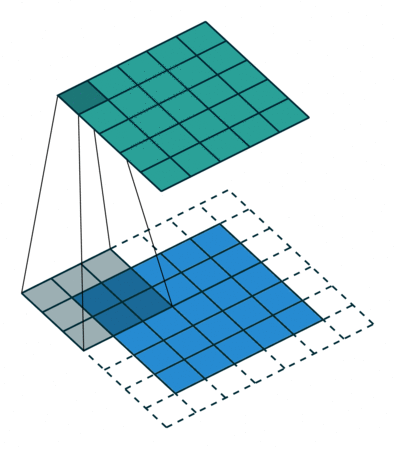
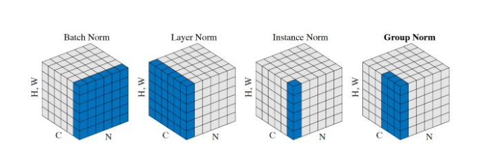

# Notes for Machine Learning
## 
## Deep Learning
+ Concepts
  + Convolution\
    
    + Transpose-
  + Activation
  + Normalization\
    
    + batch normalization
      + standardization inputs data
      + normalization and rescaling of the input data
      + offset of the input data
  + Regulization
  + Optimization
