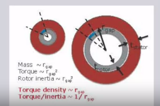
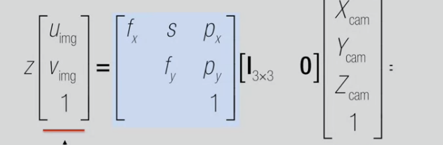
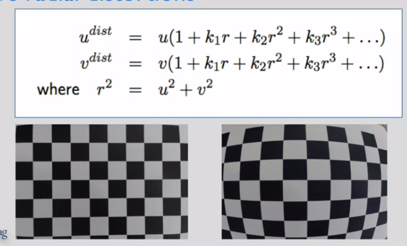
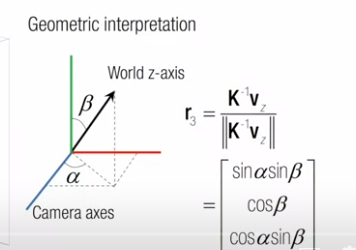
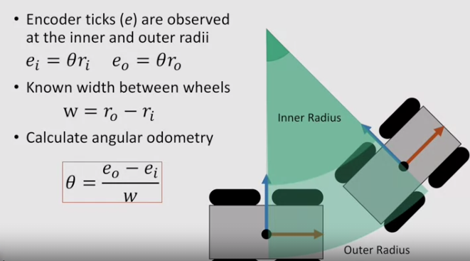

<script type="text/javascript" src="http://cdn.mathjax.org/mathjax/latest/MathJax.js?config=default"> </script>

# Robotics
## Aerial Robots
## Computational Motion Planning
+ Path planning
+ Configuration Space
  + 
+ Probabilistic Road Maps
  + Random Graph Construction
    + choose configuraion in configration space random
    + then check collision
    ```
    Repeat n times:
    Gen random pt in cofig space x
    if x in freespace:
        find the k closet points in the roadmap to x according to the Dist func
        try to connect the new random sample of each of the kneighbors uisng the Local Planner proecedure. Each succesfful cnnection forms a new edge in the graph
    ```
     + Dist func
       + angular displacements
     + Local planner
       + if there is a path between two sample 
  + Issues
    + fail to find a path even exists(not complete)
  + Rapidly Exploring Random Tree(RRT) Method
    + RRT Procedure
      ```
        Add start node to ree
        Repeat ntimes:
        Generate a random config, x
        if x in freespae, CollisionCheck func
            find y, closest node in the tree to the random config x
            if (Dist(x,y)>delta)#chekc if x is too far from y
                find a config z, that is along the path from x to y s.t. Dist(z,y)<= delta
                x = z
            if (localPlanner(x,y))#Check if you can get from x to y
                Add x to the tree and y is the parent.
      ```
      using 2 trees for goal and end until they meet.
      ```
          While not done
              Extend Tree A by adding a new node x
              Find the closest node in Tree B to x,y
              if (LocalPlanner(x,y))# Check if you can bridge the 2 trees
                  Add edge betwee x and y
                  # completes a route betwee the root of Tree A and root of Tree B
              else
                  swap Tree A and Tree B # so extend Tree B next round
      ```
         
+ Artificial Potential Fields
  + smooth function
  + use gradient to guide robots
  + Construction
    + attractive potential function
      + attract robot to the goal
    + repulsive potential function
      + repulse from the obstacle
      
    + combine the funciton
  + guide the robot
    + while robot not close enough to goal
      + choose direction based on the gradient and appropriate robot speed
      
  + Local Minima
    + useful heuristic
  + Generalizing
    + consider a set of control points over the surface of the robot
  
## Mobility
+ legged mobility
  + manage of energy
  + specific force
  
+ LTI Mechanical Dynamical Systems
  + f=ma
  + mx'' = -bx'
  + total energy as norm
  $$ eng(x) = k(x_2) +\phi(x_1)
            = \frac{1}{2}||[\sqrt{k}x_1,\sqrt{m}x_2]||^2 $$
+ Linearization
  + Taylor's Theorem
    + f(x) = f(x*)+f'(x*)(x-x*) + O(||x-x*||^2)
    


## Perception
+ Camera Modeling
  + thing len
  $$ \frac{1}{f} = \frac{1}{a}+\frac{1}{b}$$
+ Single View Geometry
  + measurements on planes
    + unwarp then measure
    + vanishing point
      + at infity, converge point of vanishing lines
+ Homogeneous coordinate
  + projective lines
    + line is a plane of rays through origin
      + all rays (x,y,z) satisfying ax+by+cz = 0
      + homogeneous 3-vector I
      + line is $\rho = xcos\theta + ysin\theta$
        $cos \theta = \frac{a}{\sqrt{a^2+b^2}}$
        $sin \theta = \frac{b}{\sqrt{a^2+b^2}}$
        $\rho = -\frac{c}{\sqrt{a^2+b^2}}$
    + from two points
      $ l = x \times x'$ 
    + (0,0,1) horizon of image plane
  + point line duality
    + intersection of two lines p
      $$ p = I_1\times I_2$$
    + point (x,y,0)
      + line l =(a,b,c) intersects at (b,-1,0)
    + line at infinity =(0,0,1)
    + ideal point and ideal lines
      + (x,y,0)
  + Transformation
    + between camera an world coordinate systems
    + camera with respect to the world
      $$ P^c_w = -{R^c_w}^T T^c_w$$
  
+ Pinhole camera
  + $[X 1]^T$ =L(K[R T][X 1]^T)$
  + focal length and dolly zoom effect
    + large focal length compresses depth
  + dolly zoom
    + series of images change focal length fixing objects
    + get bigger
  + Intrinsic Camera Parameter
    + conversion from mm to pixels
      + optical center/principle point = $(O_c,O_r)$
      + $(c-O_c) =\frac{x'}{s_x},(r-O_r) =\frac{y'}{s_y}$
    + not paralle to the ideal image plane
      + slant factor s
    + intrinsic matrix
      
+ multiple view Geometry
  + 3rd person view measurement
    + transform world to the camera then transform to image plane
+ compute intrinsics from vanishing points
  + horizon gives orientatio nof the ground plane w.r.t cam
  + vertical vanishing C with horizonal vanishing poits A and B
  + including projection center O
    + AOB,BOC,COA are right angles
      + Because the original lines are vertical to each other
  + Theorem from Euclidean Geometry:
    + if H is the orthocenter of ABC and AOB,BOC and COA are right angles, OH is perpendicular to ABC plane
    + OH is optical axis
  + let CD perpendicular to AB
  + $f^2 = BD\cdot AD - HD^2$
    + at least two vansih points not at infinity to calculate focal lenth
+ Camera Calibration
  + large field of view, radial distortions
    
  + estimate intrinsic params
    + focal lenth
    + image center
    + distortion parameters $k_i$
+ Compute Camera Orientation
  +  vanishing point z=[0 0 1 0] get rot vec $r_3$
    
  + use two vanishing points
    + e.g. x, z
    $$r_3 = K^{-1}zv_z$$
    $$ r_1 = K^{-1} zv_x$$
    $$ r_2 = r_3xr_1$$
  + planar world
    + X=[X Y 0 1]
    + $$ \hat{H} = K[r_1 r_2 t]$$
    + solve use four points 
+ Projective Transformation
  + invertible mat transformation from $P^2\rightarrow P^2$
  + preserves incidence
    + three collinear still collinear
    + three concurrent still concurrent
  + freedom of 3 four points
  + Vanishing Points
    + first two columns are orthogonal vanishing points
    + horizon on the middle of the plane
      + optical axis parallel to horizon plane
+ cross ratios and single view metrology
  + given four points A,B,C,D
  $$ CR(A,B,C,D) = \frac{AC}{AD}:\frac{BC}{BD}$$
  + if D is at infinity, cr becomes ratio
+ Two view Soccer Metrology
  + 
+ Visual features
  + detection invariance
  + descrptor invariance
  + SIFT
    + Scale Invariant Feature Transform
    + scale space
      + Gaussian * I
  + Epipolar Geometry
    +     
## Estimation and Learning
+ Gaussian Distribution
  + 1D Gaussian distribution
  $$ p(x) = \frac{1}{\sqrt{2\pi \sigma}} exp(-\frac{(x-\mu)^2}{2\sigma^2})$$
    + two params: mean and variance
    + product forms Gaussian
    + Central limit theorem
    
    + Maximum Likelihood Estimate
      + likelihood
      $$ p(\{x_i\}|\mu,\sigma)$$
      + objective
      $$\hat{\mu},\hat{\sigma} = argmax\prod p(x_i|\mu,\sigma)$$
      + solution
        $$\hat{\mu} =\frac{1}{N} \sum x_i$$
        $$\hat{sigma}^2 = \frac{1}{N}\sum (x_i-\hat{mu})^2$$
  + Multivariate Gaussian
    $$p(x)=\frac{1}{(2\pi)^{D/2}|\Sigma|^{1/2}} exp(-\frac{1}{2}(x-\mu)^T\Sigma^{-1}(x-\mu))$$
    + covariance matrix
      + diagnoal terms : variance
      + off-diagonal terms:correlation    
      + symmetric and positive definite
    + MLE
      + solution
      $$\hat{\mu} =\frac{1}{N} \sum x_i$$
        $$\hat{\Sigma}^2 = \frac{1}{N}\sum (x_i-\hat{\mu})(x_i-\hat{\mu})^T$$
  + Gaussian Mixture Model
    + weighted sum of Gaussians
      + $\mu_k,\Sigma_k,w_k$
    + Expectation Maximization
      + initial $\mu$ and $\Sigma$
      + latent variable $z_k^i = \frac{g_k(x_i|\mu_k,\Sigma_k)}{\Sigma_k g_k(x_i|\mu_k,\Sigma_k)}$
      + E step: fix $\mu$ and $\Sigma$ and update $z_k^i$
      + M Step： fix $z_k^i$ and update  $\mu$ and $\Sigma$
    + EM as lower-bound maximization
      + Jensen's inequality
      + $ln(p(X|\theta)) = ln\Sigma p(X,Z|\theta)\geq \sum q(Z) ln\frac{p(X,Z|\theta)}{q(Z)}$
+ Kalman Filter
  + state
  + measurement
  + Linear Modeling
    + $x_{t+1} = A x_t+B u_t, z_t = Cx_t$
  + Bayesian modeling
    + $p(x_{t+1}|x_t)$
    + $p(z_t|x_t)$
    + Bayes's Rule
    $$p(A|B) = \frac{P(B|A)P(A)}{P(B)}$$
  + Maximum-A-Posterior
  + unscented kalman filter
  + extended kalman filter
+ Robotics Mapping
  + map representation
  + available sensors
  + occupancy grid mapping
    + occupancy:binary R.V.
      $m_{x,y}:\{free, occupied\}$
    + each cell of grid with an occupancy
    + measurement $z~\{0,1\}$ 
      + measurement model $p(x|m_{x,y})$
    + log odd update
      + log odd += log odd meas
    + range sensor
      + bresenham's line algorithm
  + 3D mapping
    + list represent to save mem
    + tree representation
       + kd-tree
       + octree
+ Localization
  + Odometry Modeling
    + tracking angular movement
    
  + map registration
    + LIDAR Depth Sensor
      $$\sum_r \delta(p_x+rcos(p_{\theta}+r_{\theta}),p_y+rcos(p_{\theta}+r_{\theta}) \cdot m(x,y))$$
  + particle filter
    + represent mutlimodal distribution
      + correlation update
         $ w_i' = w_i \cdot corr(p_i$)
  + iterative closest point
     + initialize R and t
     + E-step: update correspondence
     + M-step Update R and t
     + stop if converged
