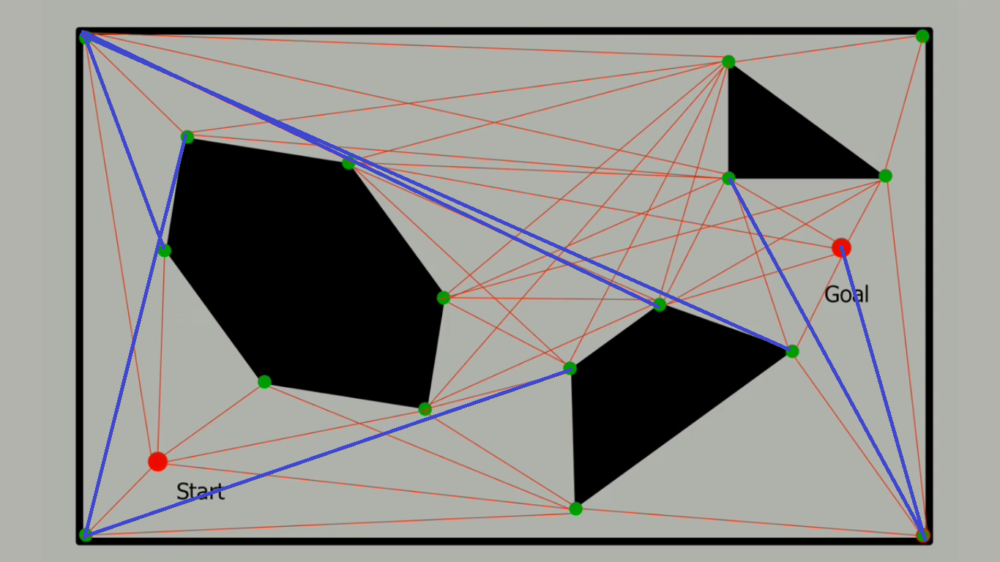
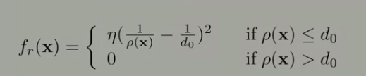
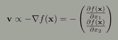

# Robotics
## Computational Motion Planning
+ Path planning
+ Configuration Space
  + 
+ Probabilistic Road Maps
  + Random Graph Construction
    + choose configuraion in configration space random
    + then check collision
    ```
    Repeat n times:
    Gen random pt in cofig space x
    if x in freespace:
        find the k closet points in the roadmap to x according to the Dist func
        try to connect the new random sample of each of the kneighbors uisng the Local Planner proecedure. Each succesfful cnnection forms a new edge in the graph
    ```
     + Dist func
       + angular displacements
     + Local planner
       + if there is a path between two sample 
  + Issues
    + fail to find a path even exists(not complete)
  + Rapidly Exploring Random Tree(RRT) Method
    + RRT Procedure
      ```
        Add start node to ree
        Repeat ntimes:
        Generate a random config, x
        if x in freespae, CollisionCheck func
            find y, closest node in the tree to the random config x
            if (Dist(x,y)>delta)#chekc if x is too far from y
                find a config z, that is along the path from x to y s.t. Dist(z,y)<= delta
                x = z
            if (localPlanner(x,y))#Check if you can get from x to y
                Add x to the tree and y is the parent.
      ```
      using 2 trees for goal and end until they meet.
      ```
          While not done
              Extend Tree A by adding a new node x
              Find the closest node in Tree B to x,y
              if (LocalPlanner(x,y))# Check if you can bridge the 2 trees
                  Add edge betwee x and y
                  # completes a route betwee the root of Tree A and root of Tree B
              else
                  swap Tree A and Tree B # so extend Tree B next round
      ```
         

+ Artificial Potential Fields
  + smooth function
  + use gradient to guide robots
  + Construction
    + attractive potential function
      + attract robot to the goal
    + repulsive potential function
      + repulse from the obstacle
      
    + combine the funciton
  + guide the robot
    + while robot not close enough to goal
      + choose direction based on the gradient and appropriate robot speed
      
  + Local Minima
    + useful heuristic
  + Generalizing
    + consider a set of control points over the surface of the robot
  


