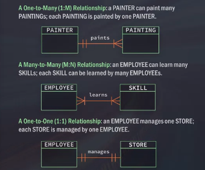
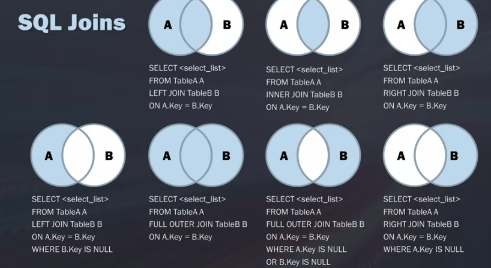

# SQL and Data Science
+ What is SQL
  + main ops
    + read/retureve data
    + write data - add data to a table
    + update data - insert new data  
  + Concepts
    + Database\
      container to store orginazed data; set of related info
    + Tables\
      structured list of data or items.
    + Cols and rows
      + Col:single field in a table
      + row: record in a table
  + Evolution
    + Data modeling
      + orgnazie and structures info into tables
      + rep business process or show relationships
      + types
        + for prediction
        + data tables
      + NoSQL - Not Only SQL
        + storage and retrieval of unstructered data modeld by means other than tab realtions
  + Data Models
    + relational 
      + allow for easy querying and data manipulation
    + transactional
      + opearational database
    + entity
      + distinguishable uniqe and
    + blocks
      + one-to-many
        + customer to invoices
      + many-to-many
        + student to classes
      + one-to-one
        + manager to store
    + ER Diagrams
      + ER model
      + primary key
        + column(uniquely idnetify every row)
      + foreign keys
        + one or more columns indeitfying a single row in another table
      + Chen Notation
        
      + Crow's Foot Notation
        
      + UML Class Diagram Notation
        
+ Retriving Data
  + SELECT
    + ``` 
      SELECT prod_name
      FROM Products;
      ```
    + ```
      SELECT prod_name,prod_id,prod_price
      FROM Products;
      ```

      ```
      SELECT prod_name,
             prod_id,
             prod_price
      FROM Products;
      ```
    + ```
       SELECT *
       FROM Products;
      ```
    + ``` 
       SELECT desired columns
       FROM specific table
       LIMIT number of records;
       ```
      Oracle\
      ```
      SELECT prod_name
      FROM Products
      WHERE ROWNUM <=5;
      ```
      DB2\
      ```
      SELECT prod_name
      FROM Products
      FETCH FIRST 5 ROWS ONLY;
      ```
+ Creating Tables
  ``` 
  CREATE TABLE shoes(
  Id char(10) RIMARY KEY,
  Brand char(10) NOT NULL,
  Price decimal(8,2) NOTNULL,
  Desc Varchar(750) NOT NULL,
  );
  ```
    + every col is either NULL or NOT NULL
    + Primary keys can not be null
    + add Data
    + ```INSERT```
    ```
    INSERT INTO Shoes
    VALUES ('14535974',
             'GUcci',
             '695.00',
             NULL
            );
    ```
    or 
    INSERT INTO Shoes
           (Id,Brand,Price,Desc)
    VALUES ('14535974',
             'GUcci',
             '695.00',
             NULL
            );
    ```
  + Temporary Tables
    + deleted when cur session is terminated
    + faster
    + useful to complex queries for subset and joins
    ```
    CREATE TEMPORARY TABLE Sandals AS(
        SELECT *
        FROM shoes
        WHERE shoe_type = 'sandals'
    )
    ```
+ Adding Comments
  + multi-lines:```/* */```
  + single"```- -```
+ Filtering
  + ```WHERE```
    ```
    SELECT column_name
    FROM table_name
    WHERE column_name operator value;
    ```
  + operators
    + ranges:```IN```
      + specific numbers ``` IN (9,10,11)```
    + ```OR```, not eval sec when first is met 
    + ```AND```, process AND before OR
    + ```NOT```
  + wildcards
    + specail character used to match parts of a val
    + ```LIKE```, predicate
      + only with strings
    + ```%Pizza``` everythin end with 'Pizza'
    + ```s%e``` start with s and end with e.
    + will not match NULL
    + ```_``` not sup by DB2
    + ```[]```
+ Sorting
  + takes one or more cols.
  + sort by col not retrieved
  + always be the last clause in a select
  ```
  SELECT something 
  FROM database
  ORDER BY characteristic
  ```
  + sort by col posistion
    ``` ORDER BY 2,3``` 
  + ```DESC``` or ```ASC```
+ Math Ops
  + ``` + - * /```
  ```
  SELECT 
  ProductID,
  UnitsOnOrder,
  UnitPrice,
  UnitsOnOrder * UnitPrice AS Total_Order_Cost
  FROM Products
  ```
+ Aggregate Functions
  + ```AVERAGE```
    ``` 
    SELECT AVG(UnitPrice) AS avg_price
    FROM products
    ```
  + ```COUNT```
  ```
  SELECT COUNT(*) as total_customers
  FROM Customers;
  ```
  + ```MIN``` and ```MAX```
    + NULL vals are ignored.
  + ``` SUM```
  + ```DISTINCT```
    + cannot use DISTINC on COUNT(*)
+ Grouping
  + ```GROUP BY```
    ```
    SELECT Region,
    COUNT(CUstormerID) AS total_customers
    FROM CUstomers
    GROUP By Region;
    ```
    + NULLs will be grouped together if your GROUP BY column contains NULLs.
  + ```HAVING```
    ```
    SELECT
    CustomerId,
    Count(*) As orders
    FROM orders
    GROUP BY CustomerID
    HAVING COUNT (*)>=2;
+ Subqueries
  + queries embedded into other queries
  ```
  SELECT 
  CustomerID,
  CompanyName,
  Region
  FROM Customers
  WHERE customerID IN(SELECT
      customerID
      FROM Orders
      WHERE Freight>100);
  ```
  ```
  SELECT customer_name,
        customer_sate
        (SELECT COUNT (*) AS orders
        FROM Orders
        WHERE Orders.customer_id = Customer.customer_id) AS orders
  FROM customers
  ORDER BY Customer_name
  ```
+ Joining Tables
  + Cartesian(Cross) Join
    + each row from the first table joins with  all the rows of another table
    ```
    SELECT product_name,
           unit_price,
           company_name
    FROM suppliers CROSS JOIN products;
    ```
    + not frequently used
    + cmputationally taxing
    + return products with the incorrect vedor or no vendor at all
  + Inner Join
    + selects records that have matching vals in both tables
    ```
    SELECT suppliers.CompanyName,
            ProductName,
            UnitPrice
    FROM Suppliers INNER JOIN Products
    ON Suppliers.supplierid = Products.supplierid;
    ```
  + Aliases and self Joins
    + Aliases
      ```
      SELECT vendor_name,
            product_name,
            product_price
      FROM Vendors AS v, Products as p
      WHERE v.vendor_id = p.vendor_id;
      ```
    + Self Joins
      + match customers from the same city
      ```
      SELECT 
      A.CustomerName AS CustomerName1,
      B.CustomerName AS CunstomerName2, 
      A.City
      FROM Customers A, Customers B
      WHERE A.CustomerID = B.CustomerID
      AND A.City = B.City
      ORDER BY A.City;
      ```
  + Left Join
    + return all records from the left table and the matched records from right 
    + NULL from the right if no match
    ```
    SELECT C.CustomerName, O.OrderID
    FROM Customer C
    LEFT JOIN Orders O ON C.CustomerID = O.CustomerID
    ORDER BY C.CUstomerName;
    ```
  + Full Outer JOins
    + Return all records when there is  match in either left or right
      ```
      SELECT Customers.CustomerName,
      Orders.OrderID
      FROM Customers
      FULL OUTER JOIN Orders ON
      CUstomers.CustomerID = Orders.CustomerID
      ORDER BY Customers.CustomerName;
      ```
  + Unions
    + combine the result-set of two or more SELECT statements
    + must have same number of cols
    + cols must hae similar data typles
    + in same order
      ```
      SELECT City Country FROM
      FROM CUstomers
      WHERE Country = 'Germany
      UNION
      SELECT City,Country FROM Suppliers
      WHERE Country='Germany'
      ORDER BY City;
      ```
    
+ Modifying Data
  + String
    + concatenate
      ```
      SELECT CompanyName,
            ContactName,
            CompanyName || '('||ConcatactName||')'
      FROM customers
      ```
    + substring
      ```
      SUBSTR first_name, SUBSTR(first_name,start,len)
      FROM employees
      WHERE department_id = 60;
      ```
    + trim
      ```
      SELECT TRIM("   You the best.   ") AS TrimmedSTRING
      ```
    + upper ```UPPER``` ```UCASE```
    + lower ```LOWER```
    
+ case statements
