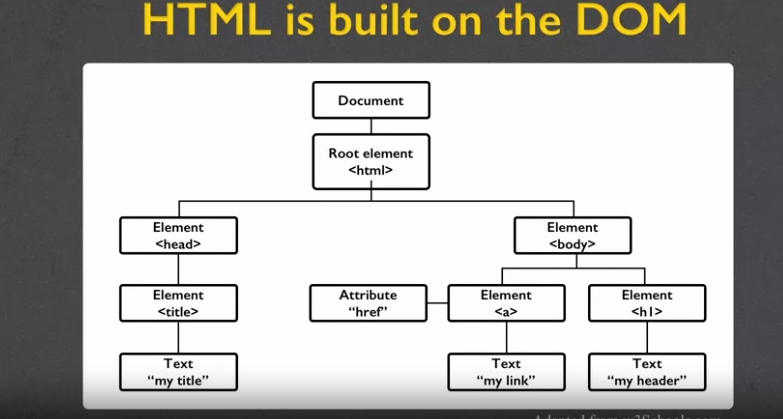

# Notes for Web Development
+ Ref: 
  +  <a href=https://www.coursera.org/learn/html-css-javascript-for-web-developers/home/welcome> HTML, CSS, and Javascript for Web Developers</a>
  + <a href="https://www.coursera.org/specializations/web-design#courses"> Cousera:Web Design for Everybody: Basics of Web Development & Coding Specialization</a>
+ Setup
  + Chrome with CDT
  + Code Editor
  + Git
  + Browser Sync
    + need NodeJS
    + browser-sync start --server --directory -- files "*"
## HTML
+ Hypertext Markup Language
  + Define structure
  + Annotates content
  + Validate the Code:validator.w3.org
+ History
  + W3C
    + HTML5(standard) 
  + WHATWG
    + HTML(evolving)
  + caniuse.com
  + browser statistics of w3c
+ How it works
  + Servers
  + Client
  + Networks
  + Request/Response Cycle
    + client requests
    + server response
      + return files
      + error codes
    + Uniform Resource Locator(URL)
      + portocol - how to connect
        + HTTP
        + HTTPS
        + FTP
      + domain - ther server
      + (optional) document
+ Document Object Model(DOM)
  + tree-like structure
  
  + doctype html
  + head 
    + meta data
    + supporting files - JS,Styling, Add-ons
  + body
    + most of the content is displayed
+ HTML Tag
  + opening tag ... closing tag
    + ``` <p> content </p>```
    + no space allowed betweening the opening bracket and the foreword slash of the closing tag
  + only opening tag
    + ```<br>``` line break
    + ```<hr>```  horizontal rule
  + Attribute:name-value pair
    +  ```<p id="myId"></p>```
    + Attribute has to be unique within the scope of the entire HTML
    + can't specify attribute on the closing tag
    + at least one space betweeen the tag and any of its attributes, extra will be ignored
    + single or double quotes but must match
    + class, id ,style, accesskey, tablindex
  + self-closing: no content
+ HTML Basis
  + from top to bottom
  + html/ex1
  + ```<!doctype html>```
    + render html
    + noncompliant-quircky mode  
  + ```<html> </html>```
    + ```<head> </head>```
      + ```<meta  charset utf-8>```
      + ```<title> </title>```
    + ```<body> </body>```
  + Content Model
    + Block-Level Element
      + begin on a new line(have its own line)
      + contain inline or other block
      + roughly flow contetn(HTML5 category)
      + ```<div></div>```
    + Inline Element 
      + same line
      + contain other inline
      + roughly pharsing content(HTML5 category)
      + ```<span></span>```
    + aligns with existing CSS rules
+ Essential HTML5 Tags
  + html/ex2
  + Heading Elements
    + in body,all block-level elements
    ```
    <h1>Main heading, crutial for search engine oriented<\h1>
    <h2>Subheading <\h2>    
    ```    
    + ```<header> header elemtn and navigation:<nav></nav>```
    ```
    <secion>
    <aside> Some information that relates to the main topic i.e. related posts</aside>
    </section>
    <footer> footer info</footer>
    ```
  + Paragraphs(block) ```<p>...</p>```
    + should only contain inline elements
  + ```<nav></nav>```
    + section of the page tha linkes to other pages or to parts in the page
    + often found in the ```<header>``` tag
  + ```<footer></footer>```
    + sec contains info such as copyright etc.
    + typically at the bottom
  + ```<figure></figure>```
    + include caption
    + multiple multi-media resources
  
  + Lists
    + only li allowed in ul
    ```
    <ul>
    <li></li>
    <li><ul></ul></li>
    </ul> 
    ```
    + ```<ol> </ol>```
  + Others
    + new structual elements
    + form
    + Input Types
    + Graphics Element
  + HTML Characketer Entity Refs
    + distinguish HTML character from content
    + escape < > &
      + use ```&lt; &gt; &amp;``` 
    + ```&copy;```
    + ```&nbsp;```
      + use between each word
      + misuse: for space;use span tag instead 
    + ```&quote;```  
  + Links
    + a for anchor link
    + hyper-reference and content
    + target
      + ```_self```:default
      + ```_blank```: open in new tab
      + ```<a href="" title="" target="_blank"></a>```
      + ```<a href="" name="" target="_blank"></a>```
    + Absolute
      + put full url in href
    + Relative
      + link to a local file in the same folder
      + fragement specify ``` <a href="#section1"></a> ```
      then go to part ```<a name="section1"></a>```
    + Internal
    + Graphical
      + image as link
    + both inline and block  
  + Images
    + ``````
    + inline
    + width and height can help reserve space
    + when use url add ```<meta name="referrer" content="no-referrer">``` in head if can not dispaly(seems security issues)
    + suggest using Percentages for size
    + favicons
      + put image/logo/icon next to the title
      + go in ```<head>``` section
        + ```link rel="icon" type="image/png" heref="imgs/*.png"/>
    + Alternative Text
      + provides a textual alternative
      + provides sematice content to search engine
  + Font Awesome
  + Multimedia
    + video and audio
    + ```<video></video>```
      + loop
      + autoplay
      + controls
      + height,width
    + ```<audio></audio>```
      + autoplay,loop
      + buffered
      + ```.ext#t=5,25```
  + Tables
    ```
    <table>
        <tr><td> One</td></tr>
        <tr><td> One</td></tr>
        <tr><td> One</td></tr>
    </table>
    ```
    + table headings ```<th></th>```
    + spanning multiple cells
      + ``` <td rowspan="2">```
    + ```<table border="1">```
## CSS
+ Style
  + color
  + Fontsize
  + cascade style sheet
+ CSS Rule
  + selector { #declaration
              property:value;}
    ``` 
    p{color:blue;
       font-size:20px;
       text-align:center;
    }
    ```
    + element selector: specify element type e.g. p
    + class selector:marked with class 

      ```
      .blue {
          color: blue;
      }
      <p class="blue"> </p>
      ```
    + id Selector: marked with id
      ```
      #name{
          color: blue;
      }
      ```

    + grouping selector

      ```
      div, .blue{
          color:blue;
      }
      ```
    + Combining Selectors
    + element with class: p with class    
      ```
      p.big {
          font-size: 20px;
      }
      ```

    + Child Selector: p element as a direct child of article element

    ```
    article > p {
        color: blue;
    }
    ```

    + Descendant Selector:decendant not necessarily direct
    
    ```
    article p{
        color: blue;
    }
    ```

    + not limited to element selectors

    ```
    .colored p{
        color: blue;
    }
    p > .colored{
        color: blue'
    }
    ```

    + Pseudo-Class Selectors
      + selector:pseudo-class
      + predefined class names:
        + :link
        + :visited
        + :hover
        + :active: click but not release
        + :nth-child()
      
      ```
      a:link, a:visited{
          text-decoration: none;
          border: 1px solid blue;
          display: block;
      }
      header li:nth-child(3){
          font-size: 24 px;
      }
      section div:nth-child(odd){
          background-color: gray;
      }
      ```
  + inline styling(not recommend)
  + external style sheet(.css)
    + ``` <link rel="stylesheet" href="style.css">```
  + conflict resolution
    + origin precedence
      + Last declaration(top to bottom)
      + external CSS as declared as the spot it linked to
      + declaration merges
    + inheritance
      + children inherit the style
      + parent will not inherit style of children
    + specificity
      + Most specific selector combination wins(score)
        + inline style
        + id
        + class, pseudo class
        + num of elements
  + styling text
    + ``` 
        fontfamily: Arial,Helvetia,sansserif;   
        color:#0000ff;\\rgb
        font-style:italic;
        font-weight:bold;
        font-size:24px;
        text-transform:capitialize;\\lowercase;
        text-align:right;
        overflow: hidden;\\scroll|auto
        ```
      + provide some options if user have no this font
      +  2em accumulate
  + Box Model
    + ``` padding: top,right,bottom,left```
    + ``` * {} ``` select but not inherit
    + Margin is part of the box away from the edge
    + border, padding will accumulate
    + in CSS3 box-sizing:border-box(then width will include padding and border)
    + Margin cumulative horizontally but collpase(larger win) when vertically.
  + Background
    + background-color:blue;
    + ```background-repeat:no-repeat```
    + ```background-position:right```
    + all in one:
       ```
       background:url('*.png)
       no-repeat right center;
       ```
       + overwrite pre-defined slash property
  + Floating Element
    + ```float:right```
    + float element margin not collapse
  + Element Positioning
    + ```position:absolute/relative```
    + Relative
      + relative to normal doc flow
      + top,bottom,left,right(offset)
      + not taken out of normal doc flow
        + moved original spot is perserved
      + relative to the position of the nearest andcestor 
    + Absolute
      + static in doc flow except html
  + Responsive Design
    + Media Queries
      ```
      @media (max-width:767px) and (min-width:128px){\\if true fall in the part
        p{
          color:blue;
        }
      }
      ```
      + , equivalent to OR
      + start with some base styles
      + carefule not to overlap range boundaries
    + Responsive Design
      + content is like water
      + adapt layout to the viewing environment by using fluid proportion-based grids, flexible images, and CSS3 media quries
      + Server detect user-agent, i.e. browser
      + 12-column grid layout
      + viewport meta tage to turn of default mobile zooming
+ Twitter Boostrap
  + most popular HTML,CSS,JS Framework for responsive mobile first project
  + Setup
    + getbootstrap.com/getting-started Download
    + jQuery,save to/js
  + Grid System Basics
    + 12 column
    ```
    <div class="container">
    <!-- container-fluid: stretches the layout the full width of the browser and provides consistent padding -->
      <div class="row">
        <!-- creates horizontal groups of columns -->
        <div class="col-md-4">Col 1</div>
        ...
      </div>
    </div>
    ```
    + every column ```col-SIZE-SPAN```
      + SIZE: screen width range identifier
      + columns will collapes(i.e. stack) below that width
        + unless antoher rule applies
      + SPAN [1,12] 
    + 
## Javascript
+ Behavior,Function

   
